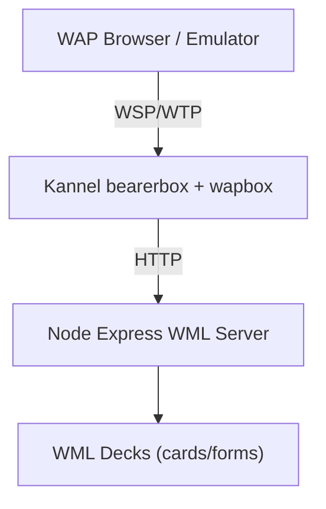

# WAP Lab v2: Local Legacy WAP Stack

A modern local lab that emulates a classic carrier WAP path:

`WAP Client -> WSP/WTP -> Kannel Gateway -> HTTP -> WML Application Server`

This version includes a stateful demo app (register/login/session/portal), smoke tests, and teaching-oriented documentation.

## Architecture



## Project Layout

```text
wap-lab/
├── docker/
│   └── kannel/
│       ├── Dockerfile
│       ├── kannel.conf
│       └── start.sh
├── scripts/
│   └── smoke.sh
├── wml-server/
│   ├── package.json
│   ├── server.js
│   ├── viewer.html
│   └── routes/
│       ├── index.wml
│       ├── login.wml
│       └── register.wml
├── docker-compose.yml
├── Makefile
└── README.md
```

## What Is Included

- Kannel gateway with both `bearerbox` and `wapbox`
- Admin endpoint on port `13000`
- WAP gateway endpoint on port `13002`
- Node/Express WML server on port `3000`
- Dynamic WML auth flow:
  - `/register` (POST form)
  - `/login` (POST form)
  - `/portal?sid=...`
  - `/profile?sid=...`
  - `/messages?sid=...&page=...`
  - `/logout?sid=...`
- Static WML examples:
  - `/examples/index.wml`
  - `/examples/login.wml`
  - `/examples/register.wml`
- Basic observability:
  - request logs with request ID
  - `/metrics` plain text counters
  - `/health` JSON health check

## Gateway Configuration (Kannel)

Configured in `docker/kannel/kannel.conf`:

- `admin-port = 13000`
- `wapbox-port = 13002`
- `box-allow-ip = 127.0.0.1`
- `wdp-interface-name = "*"`
- HTTP translation/routing in `group = wapbox`:
  - `device-home = "http://wml-server:3000/"`
  - `map-url-0 = "http://localhost:13002/* http://wml-server:3000/*"`

## Quickstart (3 Minutes)

Run from the `wap-lab` directory:

```bash
make up
```

Check container state:

```bash
make ps
```

Check gateway status:

```bash
make status
```

Run smoke test:

```bash
make smoke
```

Stop everything:

```bash
make down
```

## Direct Endpoints

- Kannel admin status:
  - `http://localhost:13000/status?password=changeme`
- WAP gateway target (emulator/bridge):
  - `http://localhost:13002`
- WML server direct HTTP:
  - `http://localhost:3000`
- Browser WML card viewer:
  - `http://localhost:3000/viewer`

## End-to-End Request Trace

1. WAP client requests `http://localhost:13002/login`
2. `wapbox` maps URL to `http://wml-server:3000/login`
3. Node app returns WML deck with `Content-Type: text/vnd.wap.wml`
4. Gateway translates WSP/WTP <-> HTTP and returns response to client

## Demo Flow

1. Open `/register`, create user with 4-6 digit PIN
2. Open `/login`, authenticate
3. Follow portal link with generated `sid`
4. Browse profile and paged messages
5. Logout and confirm session is invalidated

## WML Concepts Demonstrated

- `<card>` deck design
- `<input>` form fields
- `<do>` softkey actions
- `<go>` GET/POST transitions
- `<postfield>` form submission
- multi-card navigation and pagination style links

## Observability

Server logs include request metadata:

- request ID
- timestamp
- method/path
- client IP
- user-agent and accept headers

Metrics endpoint (`/metrics`) exposes:

- `requests_total`
- `users_total`
- `sessions_total`
- `register_success_total`
- `login_success_total`
- `login_failure_total`

## Troubleshooting

### `Group 'wapbox' may not contain field 'wapbox-port'`

Cause: `wapbox-port` was placed in the wrong group.

Fix: keep `wapbox-port` under `group = core`.

### `Group 'wapbox-user' is no valid group identifier`

Cause: this Kannel package does not support that group.

Fix: route with `map-url-*` fields inside `group = wapbox`.

### `curl: (7) Failed to connect to localhost port 13000`

Cause: gateway container failed to start or crashed.

Fix:

```bash
docker compose logs kannel
docker compose up --build
```

### Smoke test fails on gateway endpoint

Cause: stack not up yet or mapping mismatch.

Fix:

```bash
make ps
make status
curl -i http://localhost:13002/
```

Note: in some environments `http://localhost:13002/` may not return a plain HTTP body promptly because the gateway endpoint primarily serves WSP device traffic. In that case, use emulator verification and rely on `13000/status` plus app logs.

## Lab Exercises

1. Add a `settings` card to portal with user preference toggles.
2. Add session timeout cleanup in `server.js`.
3. Add another `map-url` rule that proxies `/legacy/*` to a separate service.
4. Add request latency metric buckets to `/metrics`.
5. Build a tiny WMLScript endpoint and call it from a card action.

## Useful Commands

```bash
make up        # build and start
make ps        # container status
make logs      # follow logs
make status    # kannel admin status
make smoke     # smoke test against running stack
make clean     # remove containers, networks, volumes
```

## Notes

- No SMS services configured (WAP-focused only).
- No TLS (local dev only).
- WML files use WAP 1.1 DOCTYPE.
- WBXML translation is handled by Kannel/wapbox.
