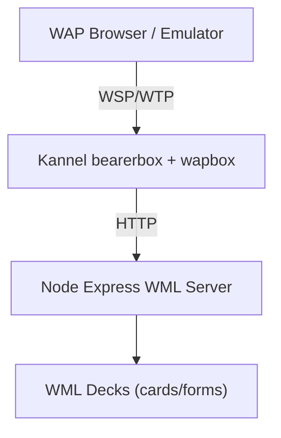
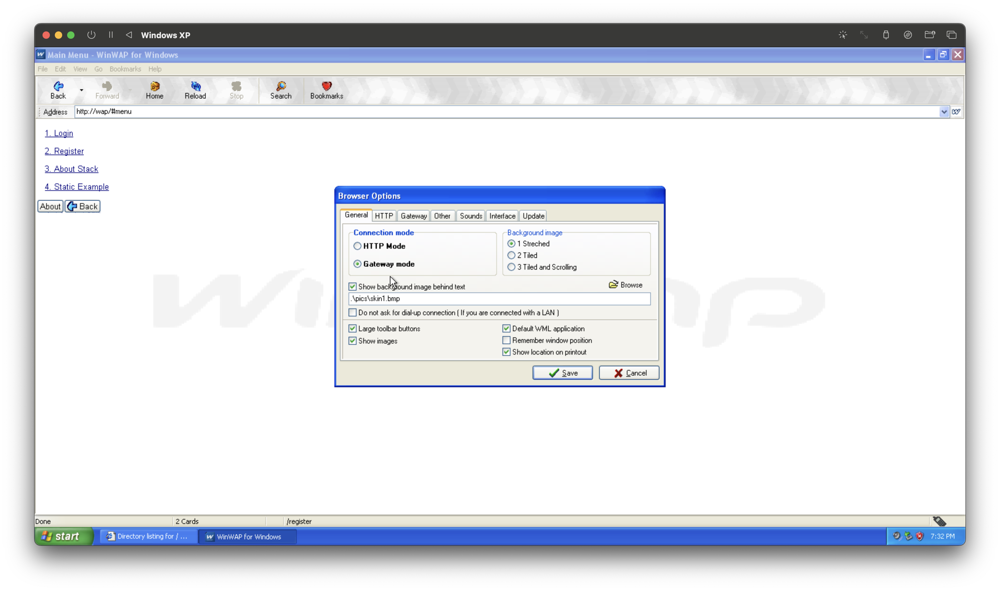
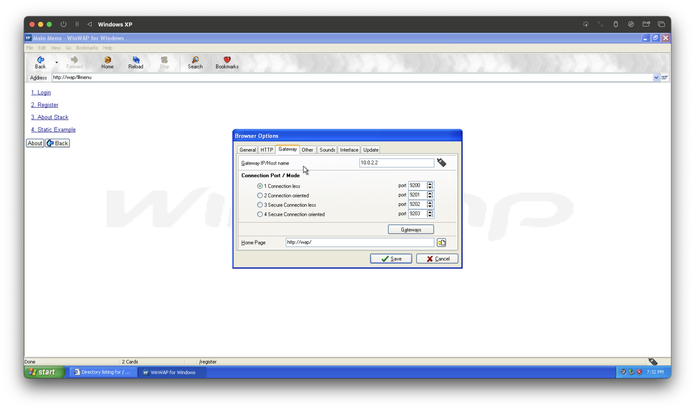
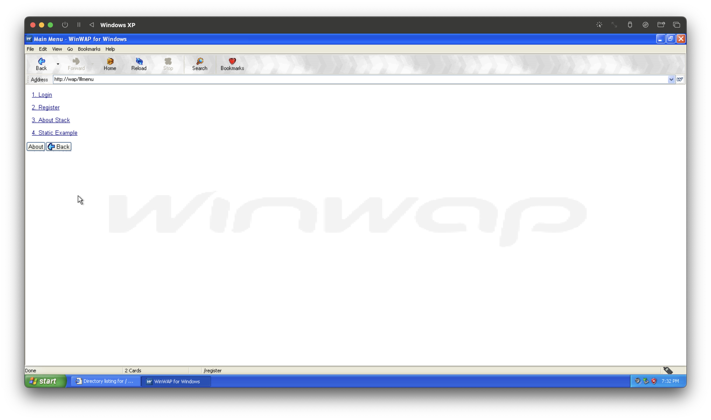
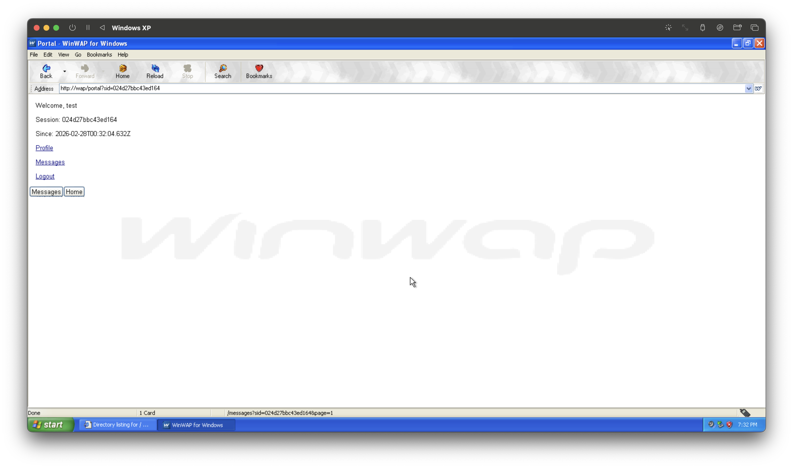

# WAP Lab v2: Local Legacy WAP Stack

A modern local lab that emulates a classic carrier WAP path:

`WAP Client -> WSP/WTP -> Kannel Gateway -> HTTP -> WML Application Server`

This version includes a stateful demo app (register/login/session/portal), smoke tests, and teaching-oriented documentation.

## Architecture



## Project Layout

```text
wap-labs/
├── docker/
│   └── kannel/
│       ├── Dockerfile
│       ├── kannel.conf
│       └── start.sh
├── scripts/
│   └── smoke.sh
├── wml-server/
│   ├── package.json
│   ├── server.js
│   ├── viewer.html
│   └── routes/
│       ├── index.wml
│       ├── login.wml
│       └── register.wml
├── docker-compose.yml
├── Makefile
└── README.md
```

## What Is Included

- Kannel gateway with both `bearerbox` and `wapbox`
- Admin endpoint on port `13000`
- WAP gateway endpoint on port `13002`
- Node/Express WML server on port `3000`
- Dynamic WML auth flow:
  - `/register` (POST form)
  - `/login` (POST form)
  - `/portal?sid=...`
  - `/profile?sid=...`
  - `/messages?sid=...&page=...`
  - `/logout?sid=...`
- Static WML examples:
  - `/examples/index.wml`
  - `/examples/login.wml`
  - `/examples/register.wml`
- Basic observability:
  - request logs with request ID
  - `/metrics` plain text counters
  - `/health` JSON health check

## Gateway Configuration (Kannel)

Configured in `docker/kannel/kannel.conf`:

- `admin-port = 13000`
- `wapbox-port = 13002`
- `box-allow-ip = 127.0.0.1`
- `wdp-interface-name = "*"`
- `group = wapbox`:
  - `device-home = "http://wml-server:3000/"`
- HTTP translation/routing in `group = wap-url-map`:
  - `url = "http://localhost:13002/*"` -> `map-url = "http://wml-server:3000/*"`
  - `url = "http://wap/*"` -> `map-url = "http://wml-server:3000/*"`
  - `url = "http://10.0.2.2/*"` -> `map-url = "http://wml-server:3000/*"`

## Quickstart (3 Minutes)

Run from the `wap-labs` directory:

```bash
make up
```

Check container state:

```bash
make ps
```

Check gateway status:

```bash
make status
```

Verify host endpoints in Chrome:

- Kannel admin: `http://localhost:13000/status?password=changeme`
- WML app health: `http://localhost:3000/health`
- WML app root deck over HTTP: `http://localhost:3000/`

Run smoke test:

```bash
make smoke
```

Stop everything:

```bash
make down
```

## Direct Endpoints

- Kannel admin status:
  - `http://localhost:13000/status?password=changeme`
- WAP gateway target (emulator/bridge):
  - `http://localhost:13002`
- WML server direct HTTP:
  - `http://localhost:3000`
- Browser WML card viewer:
  - `http://localhost:3000/viewer`
  - `http://localhost:3000/emulator`

## macOS ARM Emulator Options

### Option A: Built-in Emulator (Fast HTTP/WML Flow)

Use the built-in emulator UI on Apple Silicon (no x86 tooling required):

1. Start stack: `make up`
2. Open: `http://localhost:3000/emulator`
3. Keep URL as `/login` (default) for the full register/login/portal/logout flow
4. Use `Back` and softkey buttons to navigate cards and submit WML form actions

Notes:

- This emulator is HTTP/WML-focused and ideal for quick visual/flow testing.
- Optional gateway bridge path is available at `/gateway/*` if your environment exposes a reachable HTTP gateway endpoint.

### Option B: Real WAP 1.x Microbrowser (UTM + Windows XP + WinWAP/Openwave)

This path runs a legacy microbrowser and sends real WSP traffic through Kannel.

Flow:

`WinWAP or Openwave Microbrowser -> WSP/UDP -> Kannel bearerbox (9200) -> wapbox -> HTTP translation -> Node WML server`

#### Prerequisites

Ensure these are running on your Mac:

- Node WML server
- Kannel bearerbox
- Kannel wapbox

Start and verify:

```bash
make up
make status
```

Admin status URL:

- `http://localhost:13000/status?password=changeme`

#### 1. Install UTM

Download and install UTM:

- [UTM for macOS](https://mac.getutm.app)

#### 2. Create Windows XP VM

In UTM:

1. `Create New` -> `Emulate` -> `Windows`
2. Use Windows XP Professional SP3 (x86 ISO)

Recommended VM settings:

- Memory: `512 MB`
- CPU: `1`
- Storage: `10 GB`
- Graphics: `Default VGA`
- Networking: `Shared Network (NAT)`

Important:

- Do not enable Metal
- Do not enable VirGL
- Do not use Virtualize mode

XP must run under Emulation.

#### 3. Install Windows XP

You can get the latest options to download:

[UTM Windows XP Config](https://mac.getutm.app/gallery/windows-xp)

[Windows XP Pro ISO](https://archive.org/details/WinXPProSP3x86)

Boot the VM and complete normal XP installation:

1. Boot from CD
2. Format NTFS (Quick)
3. Finish setup and reboot as requested

#### 4. Install UTM Guest Tools (Required)

Inside UTM VM window:

1. CD icon -> `Install Windows Guest Tools`
2. In XP, open `My Computer` -> CD drive
3. Run `setup.exe`
4. Restart VM

#### 5. Verify VM -> Host Network Access

Inside XP:

```bat
ipconfig
```

Find `Default Gateway` (typically `10.0.2.2` in UTM NAT mode). This should route to your Mac host.

In XP Internet Explorer, test:

- `http://10.0.2.2:13000/status?password=changeme`

If it loads, VM can reach your local Kannel gateway.

#### 6. Install Openwave SDK (Experimental)

Openwave is legacy/discontinued software and is difficult to source. This community reference can help locate installers and plugin notes:

- [Openwave SDK references](https://wapreview.com/3733/)

Inside XP, install Openwave SDK 6.x and launch the Openwave Microbrowser.

Current blocker: the required Openwave WAP browser plugin component is missing in our current setup. Until that plugin is found/installed, Openwave doesn't properly run in WAP Gateway mode so cant connect from my testing.

During install, enable the browser/plugin components required by the SDK. If the microbrowser opens but cannot render local test pages, rerun installer in `Modify` mode and add the missing plugin component.

If Openwave does not render pages after install in your XP image, use WinWAP as primary (known good in this lab) and treat Openwave as optional.

#### 6b. Install WinWAP (Recommended)

Inside XP, install WinWAP and use it as your primary WAP browser for this lab.

Download WinWAP [HERE](https://www.winwap.com/downloads/downloads.php)

Note: WinWAP/Openwave installers are not committed to this repository because of third-party licensing.

#### 7. Configure WinWAP WAP Gateway (Recommended)

Open WinWAP -> `Browser Options`:

- `General` tab:
  - Select `Gateway mode` (not HTTP mode)
- `HTTP` tab:
  - Disable `Use HTTP Proxy`
  - Disable `Use HTTP Proxy Authentication`
- `Gateway` tab:
  - `Gateway IP/Host`: `10.0.2.2`
  - `Connectionless` port: `9200`
  - Home page: `http://wap/login` (or `http://10.0.2.2/login`)

Save and restart WinWAP.

WinWAP Setup Example:




#### 8. Configure Openwave WAP Gateway (Optional)

Openwave -> `Edit` -> `Preferences` -> `Network`

Set:

- Use WAP Gateway: Enabled
- Gateway IP: `10.0.2.2`
- Port: `9200`
- Bearer: `UDP`

Disable:

- HTTP Proxy

#### 9. Test WSP Routing

Inside WinWAP/Openwave browse to:

- `http://wap/login`
- fallback: `http://10.0.2.2/login`

Should see pages similar to tihs




Watch logs on host:

```bash
docker compose logs -f kannel wml-server
```

You should see WSP activity (not plain browser HTTP GET from a desktop browser).

#### 10. Host File Server for XP VM (Installers/Artifacts)

Run a temporary file host on your Mac:

```bash
cd /Users/dsteele/repos/wap-labs/files
python3 -m http.server 8080
```

From XP browser, open:

- `http://10.0.2.2:8080/`

Download what you need inside XP, for example:

- `http://10.0.2.2:8080/winwap-win32.exe`
- `http://10.0.2.2:8080/Openwave_SDK_622.exe`

Stop file host with `Ctrl+C` when done.

#### 11. Debugging

Cannot reach gateway from XP:

- Recheck XP URL: `http://10.0.2.2:13000/status?password=changeme`
- Confirm VM network mode is Shared Network (NAT)
- Confirm stack is running: `make ps`
- Check host firewall rules for local ports

Openwave loads nothing:

- Confirm UDP ports `9200/9201` are published in `docker-compose.yml`
- Confirm `wdp-interface-name = "*"` in `docker/kannel/kannel.conf`
- Restart stack:

```bash
docker compose restart
```

HTTP desktop requests showing instead of WSP flow:

- Recheck WinWAP/Openwave proxy/gateway settings and ensure HTTP proxy is disabled.

WinWAP returns HTTP 503 for `http://wap/*`:

- Check `docker compose logs kannel` for `map_url_max = -1`
- If present, you are using deprecated mapping format; use `group = wap-url-map` entries in `docker/kannel/kannel.conf`
- Restart gateway: `docker compose up -d --build kannel`

#### Success Criteria

You have real WAP 1.x microbrowser emulation when:

- WinWAP or Openwave renders WML decks
- `<card>` navigation works
- `<input>` and `<go>` form flow works
- Kannel logs show WSP-side activity through wapbox

## End-to-End Request Trace

1. WAP client requests `http://localhost:13002/login`
2. `wapbox` maps URL to `http://wml-server:3000/login`
3. Node app returns WML deck with `Content-Type: text/vnd.wap.wml`
4. Gateway translates WSP/WTP <-> HTTP and returns response to client

## Demo Flow

1. Open `/register`, create user with 4-6 digit PIN
2. Open `/login`, authenticate
3. Follow portal link with generated `sid`
4. Browse profile and paged messages
5. Logout and confirm session is invalidated

## WML Concepts Demonstrated

- `<card>` deck design
- `<input>` form fields
- `<do>` softkey actions
- `<go>` GET/POST transitions
- `<postfield>` form submission
- multi-card navigation and pagination style links

## Observability

Server logs include request metadata:

- request ID
- timestamp
- method/path
- client IP
- user-agent and accept headers

Metrics endpoint (`/metrics`) exposes:

- `requests_total`
- `users_total`
- `sessions_total`
- `register_success_total`
- `login_success_total`
- `login_failure_total`

## Troubleshooting

### `Group 'wapbox' may not contain field 'wapbox-port'`

Cause: `wapbox-port` was placed in the wrong group.

Fix: keep `wapbox-port` under `group = core`.

### `Group 'wapbox-user' is no valid group identifier`

Cause: this Kannel package does not support that group.

Fix: route with `group = wap-url-map` entries and `map-url` rules.

### `map_url_max = -1` and `http://wap/*` fails with 503

Cause: deprecated URL mapping format was used, so rewrite rules were not loaded.

Fix: define explicit `group = wap-url-map` blocks for:

- `http://localhost:13002/*`
- `http://wap/*`
- `http://10.0.2.2/*`

and map each to `http://wml-server:3000/*`, then restart `kannel`.

### `curl: (7) Failed to connect to localhost port 13000`

Cause: gateway container failed to start or crashed.

Fix:

```bash
docker compose logs kannel
docker compose up --build
```

### Smoke test fails on gateway endpoint

Cause: stack not up yet or mapping mismatch.

Fix:

```bash
make ps
make status
curl -i http://localhost:13002/
```

Note: in some environments `http://localhost:13002/` may not return a plain HTTP body promptly because the gateway endpoint primarily serves WSP device traffic. In that case, use emulator verification and rely on `13000/status` plus app logs.

## Lab Exercises

1. Add a `settings` card to portal with user preference toggles.
2. Add session timeout cleanup in `server.js`.
3. Add another `map-url` rule that proxies `/legacy/*` to a separate service.
4. Add request latency metric buckets to `/metrics`.
5. Build a tiny WMLScript endpoint and call it from a card action.

## Useful Commands

```bash
make up        # build and start
make ps        # container status
make logs      # follow logs
make status    # kannel admin status
make smoke     # smoke test against running stack
make clean     # remove containers, networks, volumes
```

## Notes

- No SMS services configured (WAP-focused only).
- No TLS (local dev only).
- WML files use WAP 1.1 DOCTYPE.
- WBXML translation is handled by Kannel/wapbox.

## Next-Gen Browser Track

This repo now includes a parallel implementation track for a modern WAP browser harness:

- Architecture: `docs/modern-wap-browser-architecture.md`
- Gateway track: `gateway-kannel/`
- Python transport API: `transport-python/api/openapi.yaml`
- Electron transport types: `electron-app/contracts/transport.ts`
- WASM engine contract: `engine-wasm/contracts/wml-engine.ts`
- WASM engine full setup guide: `engine-wasm/README.md`

The boundary model is:

1. `transport-python` owns UDP/WSP, retries, and WBXML decode.
2. `engine-wasm` owns WML runtime semantics and render-list output.
3. `electron-app` owns host UI, key mapping, and debug tooling.

## Contributing

- Contributor guide: `CONTRIBUTING.md`
- Codex steering: `AGENTS.md`
- Repository formatting conventions: `.editorconfig`

## License

This project is licensed under the MIT License. See `LICENSE`.
