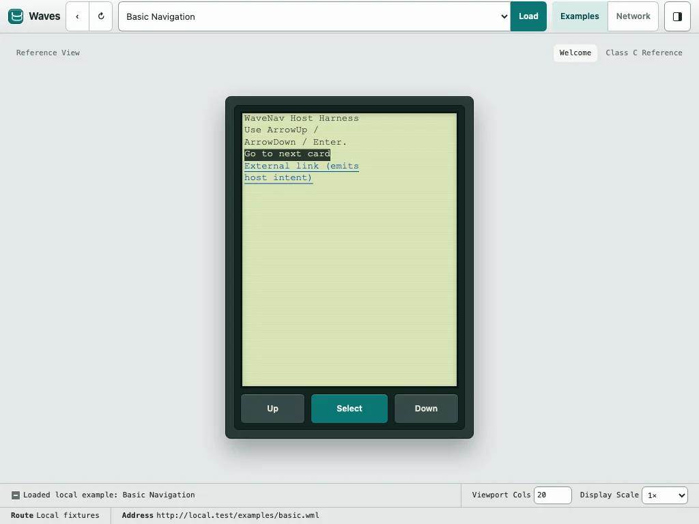
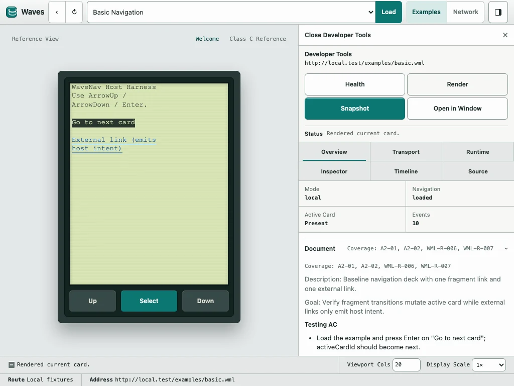
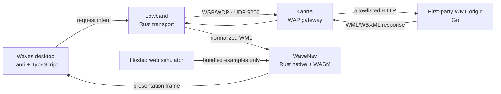

# WAP Labs

[](https://github.com/dills122/wap-labs/actions/workflows/ci.yml)
[](LICENSE)

WAP Labs is a modern, deterministic browser and testing stack for the early mobile web. It pairs
the Waves desktop browser with a Rust WML runtime, native WAP transport, a hosted interoperability
lab, and traceable WAP 1.2.1 / WML 1.3 implementation evidence.

[Project site](https://dills122.github.io/wap-labs/) ·
[Web simulator](https://dills122.github.io/wap-labs/simulator/) ·
[Project Atlas](https://dills122.github.io/wap-labs/atlas/) ·
[Documentation](docs/README.md)



> [!IMPORTANT]
> WAP Labs is pre-alpha and pre-conformance. The web simulator is available now, but a packaged
> Waves desktop release is not. The public WAP lab is unencrypted testing infrastructure and does
> not provide WTLS.

## What is in the stack?

| Surface                                                          | Role                                                                                                   |
| ---------------------------------------------------------------- | ------------------------------------------------------------------------------------------------------ |
| **Waves** (`browser/`)                                           | Tauri desktop host, browser chrome, input, application state, and developer tooling                    |
| **WaveNav** (`engine-wasm/`)                                     | Rust WML parser and deterministic deck/card runtime, built for native and WASM targets                 |
| **Lowband** (`transport-rust/`)                                  | Rust HTTP/WAP transport, connectionless WSP/WDP, WBXML normalization, and the `wapcurl` diagnostic CLI |
| **WAP Lab** (`gateway-kannel/`, `docker/kannel/`, `wml-server/`) | Kannel gateway plus a bounded Go origin serving local and hosted WML test fixtures                     |
| **Project Atlas** (`docs-portal/`)                               | Generated planning, architecture, work-item, and compliance evidence portal                            |

The project keeps protocol responsibilities deliberately separate: Lowband owns WSP, WDP, and
WBXML; WaveNav owns WML behavior and rendering; Waves owns the desktop experience.

## Try WAP Labs

### In a web browser

The [hosted simulator](https://dills122.github.io/wap-labs/simulator/) runs the real WaveNav WASM
engine against bundled examples. It is the fastest way to explore deck navigation, focus, forms,
timers, and render behavior without installing the desktop toolchain.

The simulator is intentionally network-free. Use Waves or `wapcurl` for live WAP traffic.

### Against the hosted WAP lab

Three first-party services are available through the public connectionless WSP/WDP gateway:

| Resource URL                         | What to test                                                                        |
| ------------------------------------ | ----------------------------------------------------------------------------------- |
| `wap://home.wap.shrimpworks.dev/`    | Cards, links, softkeys, history, navigation, and compact example decks              |
| `wap://forms.wap.shrimpworks.dev/`   | Inputs, selects, GET/POST flows, variables, redirects, and disposable demo sessions |
| `wap://interop.wap.shrimpworks.dev/` | Deterministic WML/WBXML, content-type, header, cache, status, and boundary cases    |

WAP resource URLs and the gateway peer are separate. Probe the lab with the same Lowband path used
by Waves:

```bash
cargo run --manifest-path transport-rust/Cargo.toml --bin wapcurl -- \
  --profile wap-net-core \
  --gateway 159.89.254.0:9200 \
  wap://home.wap.shrimpworks.dev/examples/index.wml
```

Add `--hex` to inspect the WMLC bytes, `--raw` to write the original response, or `--json` for
machine-readable output. See the [`wapcurl` guide](transport-rust/README.md#wapcurl-diagnostic-cli)
for the complete command surface.

> [!WARNING]
> UDP 9200 is an unencrypted, shared test endpoint. Send only fake data. Do not submit real
> credentials, cookies, personal information, or sensitive query values.

## Current capabilities

- Parse and validate WML 1.3 decks, cards, metadata, access rules, and selected DTD behavior.
- Navigate deterministically across cards and decks with history, focus, softkeys, timers, and
  bounded external navigation intent.
- Exercise inputs, selects, variables, GET/POST request intent, and the current WaveScript
  verification/runtime path.
- Render through an engine-owned presentation frame into a 20-column Class C reference handset.
- Fetch over HTTP or native connectionless WSP/WDP, normalize WML/WBXML, and preserve structured
  transport errors and raw response metadata.
- Inspect health, transport, runtime state, bounded engine events, snapshots, timelines, source,
  and acceptance evidence from the Developer Tools workspace.
- Run the same engine behavior through native Rust and WASM adapters with parity-focused tests and
  executable WML stories.



The implementation is substantial but deliberately does not claim full WAP Class C conformance.
At the current evidence checkpoint, 45/198 selected parent rows are implemented;
363/762 clauses are directly assessed. Current assessments, clause evidence, and remaining gaps
live in
[Project Atlas](https://dills122.github.io/wap-labs/atlas/) and the
[compliance program](docs/waves/WAP_1_2_1_COMPLIANCE_PROGRAM.md).

## Architecture


```mermaid
flowchart LR
  desktop["Waves desktop<br/>Tauri + TypeScript"]
  lowband["Lowband<br/>Rust transport"]
  gateway["Kannel<br/>WAP gateway"]
  origin["First-party WML origin<br/>Go"]
  engine["WaveNav<br/>Rust native + WASM"]
  simulator["Hosted web simulator"]

  desktop -->|request intent| lowband
  lowband -->|WSP/WDP · UDP 9200| gateway
  gateway -->|allowlisted HTTP| origin
  origin -->|WML/WBXML response| gateway
  gateway --> lowband
  lowband -->|normalized WML| engine
  engine -->|presentation frame| desktop
  simulator -->|bundled examples only| engine
```

The desktop and web paths share WaveNav behavior. Only the native desktop path reaches Lowband and
the WAP gateway; the WASM runtime never performs network fetches.

For the detailed system boundaries, see the
[technical architecture](docs/waves/TECHNICAL_ARCHITECTURE.md) and the C4 views in
[`docs/architecture/`](docs/architecture/).

## Develop locally

### Prerequisites

Use the versions and platform dependencies in the
[development prerequisites](docs/development-prerequisites.md). The repository pins a known-good
Node version in [`.nvmrc`](.nvmrc); Docker is needed only for the local Kannel/WML lab.

Bootstrap or refresh the workspace:

```bash
./scripts/init-refresh.sh
```

Run the browser frontend shell:

```bash
pnpm --dir browser run dev
```

Run the native Tauri host:

```bash
pnpm --dir browser run tauri:dev
```

Run the standalone WaveNav host-sample harness:

```bash
make dev-wavenav-host
```

Build the WASM engine directly:

```bash
cd engine-wasm/engine
wasm-pack build --target web --out-dir ../pkg
```

## Run a local WAP lab

The Compose stack provides the same Kannel-to-origin topology for development:

```bash
make up
make status
make smoke
make smoke-transport-wap
```

Kannel admin/HTTP bridge ports `13000` and `13002` and WML origin ports `3000` and `3001` bind to
loopback. UDP `9200/9201` remains available for local WAP microbrowser VMs, so run the stack only
on a trusted host/network or add an appropriate host firewall. The checked-in `changeme` Kannel
credentials are local placeholders and must never be exposed beyond loopback.

Validate the rendered publication rules with:

```bash
make check-local-compose-security
```

The [WAP test-environment guide](docs/wap-test-environment/README.md) covers the complete local
topology and validation flow.

## Verification

Choose the profile that matches the size of your change:

```bash
pnpm verify:fast       # cheap deterministic checks
pnpm verify            # change-selected repository checks
pnpm verify:full       # full local verification profile
pnpm verify:extended   # external/local-service lanes; requires their prerequisites
```

Focused checks include:

```bash
make lint-rust-transport
make test-rust-transport
pnpm test:story all
pnpm wap-graph:check
pnpm --dir browser run contracts:check
pnpm --dir docs-portal run check
pnpm --dir docs-portal run build
```

See the [local verification contract](docs/ci/LOCAL_VERIFICATION.md) for profile selection,
prerequisites, and checks that remain GitHub-hosted or environment-dependent.

## Repository map

| Path                                                                        | Contents                                                                           |
| --------------------------------------------------------------------------- | ---------------------------------------------------------------------------------- |
| [`browser/`](browser/)                                                      | Waves frontend, Tauri host, generated transport contracts, and desktop integration |
| [`engine-wasm/`](engine-wasm/)                                              | WaveNav runtime, WASM bindings, host sample, examples, and executable stories      |
| [`transport-rust/`](transport-rust/)                                        | Lowband transport library, protocol codecs, fixtures, and `wapcurl`                |
| [`gateway-kannel/`](gateway-kannel/) and [`docker/kannel/`](docker/kannel/) | Kannel interop behavior, packaging, and local gateway configuration                |
| [`wml-server/`](wml-server/)                                                | Bounded first-party Go WML origin and deterministic lab routes                     |
| [`marketing-site/`](marketing-site/)                                        | Public project site and simulator entrypoint                                       |
| [`docs-portal/`](docs-portal/)                                              | Generated Project Atlas application                                                |
| [`docs/`](docs/)                                                            | Active architecture, decisions, runbooks, work boards, and compliance evidence     |
| [`spec-processing/`](spec-processing/)                                      | Source-spec processing, provenance, and knowledge-graph generation                 |

## Documentation

- [Documentation index](docs/README.md)
- [Waves technical architecture](docs/waves/TECHNICAL_ARCHITECTURE.md)
- [Browser integration work board](docs/waves/WORK_ITEMS.md)
- [WaveNav engine documentation](docs/wml-engine/README.md)
- [Lowband transport documentation](transport-rust/README.md)
- [Public WAP lab and pre-release plan](docs/waves/PUBLIC_WAP_LAB_PRERELEASE_PLAN.md)
- [WAP 1.2.1 compliance program](docs/waves/WAP_1_2_1_COMPLIANCE_PROGRAM.md)
- [Contributor guide](CONTRIBUTING.md)

Last reviewed: 2026-08-02 against `origin/main` at `0028946e`.

## Contributing and license

Contributions are welcome. Start with [CONTRIBUTING.md](CONTRIBUTING.md), follow the layer
contracts in [AGENTS.md](AGENTS.md), and keep protocol/runtime behavior deterministic and
test-backed.

WAP Labs is available under the [MIT License](LICENSE). See [AUTHORS.md](AUTHORS.md) and
[NOTICE.md](NOTICE.md) for attribution and notices.
