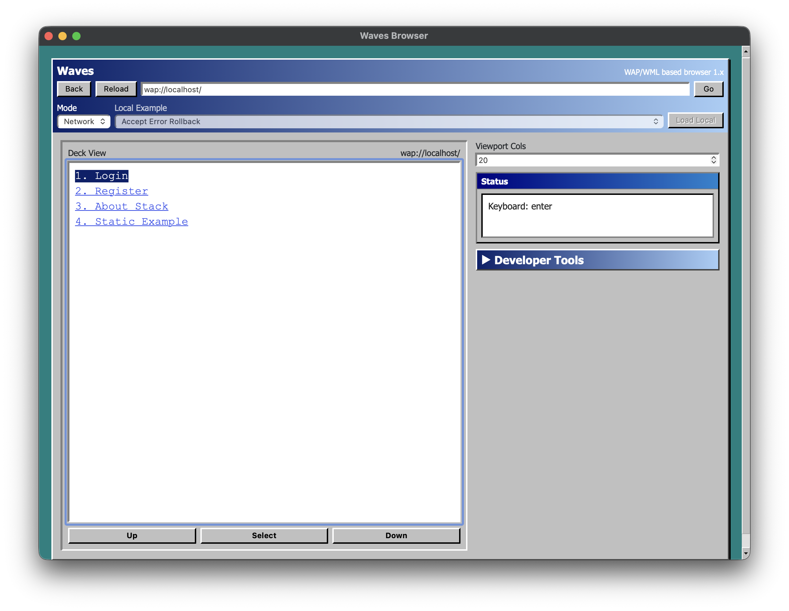

# WAP Labs

WAP Labs is focused on building a modern, deterministic WAP browser stack:

- `browser/`: Waves desktop host (Tauri frontend + native command bridge)
- `engine-wasm/`: WaveNav runtime engine (Rust core with wasm + native targets)
- `transport-rust/`: Lowband transport and WAP/WML handoff pipeline

The legacy/demo stack still exists for compatibility testing (`gateway-kannel/`, `wml-server/`), but it is no longer the primary product focus.



## Start Here

- Browser/engine architecture and roadmap: `docs/waves/TECHNICAL_ARCHITECTURE.md`
- Browser integration work board: `docs/waves/WORK_ITEMS.md`
- Maintenance and tech debt board: `docs/waves/MAINTENANCE_WORK_ITEMS.md`
- Engine implementation board: `docs/wml-engine/work-items.md`
- Engine phase roadmap (`A-D`): `docs/wml-engine/ticket-plan.md`
- Transport phase roadmap (`A-D`): `docs/waves/TRANSPORT_RUST_PHASE_PLAN.md`
- Frame-interface migration plan: `docs/waves/ENGINE_HOST_FRAME_MIGRATION_PLAN.md`
- Frame-interface phase board (`F0-F4`): `docs/waves/ENGINE_HOST_FRAME_WORK_ITEMS.md`
- Project Atlas (generated planning/compliance portal): `docs-portal/README.md`
- WAP 1.2.1 compliance program: `docs/waves/WAP_1_2_1_COMPLIANCE_PROGRAM.md`
- Development prerequisites + bootstrap: `docs/development-prerequisites.md`
- Documentation index: `docs/README.md`

Secondary docs:

- Usability and graceful-failure backlog: `docs/waves/USABILITY_RESILIENCE_BACKLOG.md`
- Legacy test environment guide: `docs/wap-test-environment/README.md`
- Browser emulator quickstart: `docs/browser-emulator/README.md`
- Spec-processing subproject: `spec-processing/README.md`

## Progress Snapshot

Status source: `docs/waves/wap-1.2.1-compliance-program.json`,
`docs/waves/WORK_ITEMS.md`, `docs/waves/MAINTENANCE_WORK_ITEMS.md`,
`docs/wml-engine/work-items.md`, and `.github/workflows/engine-fuzz.yml`
(updated 2026-07-25).

| Track | Implemented | Roadmap / In Progress |
|---|---|---|
| Waves desktop app (`browser/`) | Desktop shell is usable end-to-end: network/local mode, runtime deck navigation, focused text/select editing, browser back/reload flow, debug/timeline surfaces, and an ordinary-browser story adapter backed by the real WASM engine | Preserve the completed W0-05 timer/dialog baseline while broadening spec-driven stories; keep downstream Dialogs/WMLS-5 and debug-connector work dependency-gated |
| WaveNav runtime (`engine-wasm/`) | Runtime covers deck/card parsing, navigation, focus, input/select semantics, deterministic render output, native/WASM parity checks, and 23/23 mapped WML-204 clause fixtures | Finish the remaining WML-2 parser/DTD/error gaps before advancing WML-3 runtime breadth |
| Lowband transport (`transport-rust/`) | The selected WDP path is 9/9 rows implemented, the strict CDPD/IPv4 WCMP profile is 2/2 rows implemented through ICMPv4, TRN-702 constraints and the TRN-706 WDP replay tranche are direct-fixture-backed, TRN-707 records the successor delta, and the pinned WBXML decoder has all 47 selected client clauses implemented | Close broader WBXML feature-row limitations and selected connectionless WSP evidence; activate general WCMP only for explicit non-IP bearers and WTP only with connection-oriented WSP |
| WAP evidence program | 22/198 selected parent rows are implemented and 141/761 clauses are directly assessed; Atlas renders the canonical program and active documents | 77 partial and 99 missing parents remain, so the project stays explicitly pre-conformance |
| Frame-based render/input migration | Additive frame-oriented host commands are already in place for the hot browser paths | Finish the deliberate `M1-09` migration only after the current runtime/debug boundary work settles |
| Fuzz hardening (`engine-wasm/engine/fuzz`) | Cargo-fuzz scaffold with `engine_wml_fuzzer`, starter corpus seeds, and scheduled weekly CI run | Add target coverage for transport/protocol surfaces, grow dictionaries/corpus, and tune campaign budgets |
| Legacy/demo stack (`gateway-kannel/`, `wml-server/`) | Still available for compatibility smoke checks | Maintenance only; not the main build track |

## Repo Map (Product-First)

- `browser/`: Waves desktop host product surface (frontend + Tauri integration)
- `engine-wasm/`: Runtime engine, wasm bindings, and host sample harness
- `transport-rust/`: In-process transport library and contract handoff
- `docs/`: architecture, contracts, traceability, and work boards
- `gateway-kannel/`, `docker/kannel/`: legacy gateway test environment
- `wml-server/`: local demo/fixture WML server
- `marketing-site/`: project site and hosted simulator entrypoint
- `spec-processing/`: canonical source-spec processing and provenance

## Quick Commands (Browser/Engine)

Bootstrap:

```bash
./scripts/init-refresh.sh
```

Run browser frontend shell:

```bash
pnpm --dir browser run dev
```

Run desktop Tauri host:

```bash
pnpm --dir browser run tauri:dev
```

Run engine host-sample harness:

```bash
make dev-wavenav-host
```

Build engine wasm package directly:

```bash
cd engine-wasm/engine
wasm-pack build --target web --out-dir ../pkg
```

Quality checks:

```bash
make ci-local
make lint-rust-transport
make test-rust-transport
pnpm test:story all
pnpm wap-graph:check
pnpm --dir docs-portal run check
pnpm --dir docs-portal run build
cd engine-wasm/engine && cargo +nightly fuzz run engine_wml_fuzzer -- -runs=200
```

## Quick Commands (Legacy/Compatibility)

Legacy stack:

```bash
make up
make status
make smoke
make smoke-transport-wap
# optional direct gateway override:
# GATEWAY_HTTP_BASE=http://localhost:13002 make smoke-transport-wap
```

`make smoke-transport-wap` is the local Kannel/browser transport smoke entrypoint for the active native/browser validation lane; check `docs/waves/TRANSPORT_E2E_READINESS_SCORECARD.md` for current posture and evidence.

Marketing site local dev:

```bash
cd marketing-site
pnpm install
pnpm run dev
```

Make shortcuts:

```bash
make install-marketing-site
make dev-marketing-site
make build-marketing-site
make preview-pages-local
```

Local GitHub Pages-style preview (build + assemble only):

```bash
./scripts/preview-pages.sh --no-serve
```

Repo quality checks and hooks:

```bash
make ci-local
make lint-rust-transport
make test-rust-transport
make coverage-rust-transport
make hooks-install
ENABLE_NODE_CHECKS=1 make ci-local
```

Bootstrap/refresh local tool and dependency setup:

```bash
./scripts/init-refresh.sh
```

### Local AI context

Repo-specific instructions and the existing WAP-focused Codex skills stay checked in. Reusable
skills and shared steering are linked from the sibling `ai-central` checkout and are ignored by
Git:

```bash
pnpm codex:links
```

The script expects AI Central at `../ai-central` by default. Set `AI_CENTRAL_HOME` to either the
AI Central repository or its `templates` directory when the checkout lives elsewhere. Use
`pnpm codex:links -- --dry-run` to preview the links.

Local hook behavior:

- commit: runs `lint-staged` on staged files only (Prettier + rustfmt)
- push: runs strict pre-push checks

Node version note:

- Use Node `20.19+` or `22.12+` (`.nvmrc` pins a known-good version).

## GitHub Pages

- Deployment workflow: `.github/workflows/pages.yml`
- Trigger: pushes to `main` that modify the marketing site, simulator, Atlas,
  active docs/manifests, workspace locks, or the Pages workflow
- Published routes:
  - `/` -> marketing site
  - `/simulator/` -> host sample simulator
  - `/atlas/` -> canonical project Atlas

## Contributor Docs

- Contributor guide: `CONTRIBUTING.md`
- Codex steering: `AGENTS.md`
- Formatting conventions: `.editorconfig`
- Attribution: `AUTHORS.md`
- Notices: `NOTICE.md`

## License

MIT License. See `LICENSE`.
