# C4 Component View: Waves Host and Embedded SDKs

Date: 2026-07-24
Status: target architecture

This view shows the code modules embedded in the Waves Host executable. The SDK copies shown here
are linked into the process; they are not network services.

```mermaid
C4Component
  title Component Diagram - Waves Host with Embedded Lowband and WaveNav

  Container(wavesUi, "Waves UI", "TypeScript WebView", "Browser controls and render surface")
  ContainerDb(localState, "Browser State", "Local files and OS keychain", "Profiles, state, cache, and credentials")
  System_Ext(wmlOrigin, "WML Origin Server", "Hosts WML and WMLC")
  System_Ext(wapGateway, "WAP Proxy or Gateway", "Classic WAP peer")

  Container_Boundary(wavesHost, "Waves Host Executable") {
    Component(hostOrchestrator, "Host Orchestrator", "Rust and Tauri commands", "Coordinates navigation, fetch, engine, and state")
    Component(policyManager, "Host Policy Manager", "Rust", "Enforces destination, security, and resource limits")
    Component(profileStore, "Profile and State Adapter", "Rust", "Loads routes, cookies, cache, and credentials")

    Component(lowbandFacade, "Lowband Client Facade", "Rust library API", "Executes versioned resource and deck requests")
    Component(routeResolver, "Route Resolver", "Lowband module", "Separates resource URI from network peer")
    Component(httpAdapter, "Direct HTTP Adapter", "Reqwest and Rustls", "Runs HTTP and HTTPS routes")
    Component(wapClient, "Classic WAP Client", "WDP, WTP, WSP, and WTLS modules", "Runs connectionless and connection-mode routes")
    Component(bearerAdapter, "Bearer Adapter", "WDP over UDP initially", "Sends and receives datagrams")
    Component(wbxmlCodec, "WML WBXML Codec", "Bounded Rust codec or isolated sidecar", "Decodes and encodes WMLC")
    Component(contentNormalizer, "Deck Normalizer", "Lowband module", "Produces validated textual WML deck payloads")

    Component(wavenavFacade, "WaveNav Engine Facade", "Native Rust library API", "Loads decks and exposes deterministic frames")
    Component(wmlRuntime, "WML Runtime", "WaveNav parser and state machine", "Executes WML deck, card, task, and event semantics")
    Component(renderer, "Layout and Render Engine", "WaveNav layout", "Produces deterministic render commands")
  }

  Rel(wavesUi, hostOrchestrator, "Invokes commands and receives frames through", "Tauri IPC")
  Rel(hostOrchestrator, policyManager, "Obtains authoritative policy from")
  Rel(hostOrchestrator, profileStore, "Reads and updates browser state through")
  Rel(profileStore, localState, "Persists and retrieves")

  Rel(hostOrchestrator, lowbandFacade, "Requests resources and deck payloads from")
  Rel(lowbandFacade, routeResolver, "Selects an explicit route through")
  Rel(routeResolver, httpAdapter, "Dispatches direct routes to")
  Rel(routeResolver, wapClient, "Dispatches gateway routes to")
  Rel(httpAdapter, wmlOrigin, "Fetches from", "HTTP/HTTPS")
  Rel(wapClient, bearerAdapter, "Sends protocol data through")
  Rel(bearerAdapter, wapGateway, "Exchanges datagrams with", "UDP")
  Rel(lowbandFacade, wbxmlCodec, "Decodes WMLC through")
  Rel(lowbandFacade, contentNormalizer, "Normalizes accepted content through")

  Rel(hostOrchestrator, wavenavFacade, "Loads normalized decks and sends input to")
  Rel(wavenavFacade, wmlRuntime, "Executes deck semantics through")
  Rel(wmlRuntime, renderer, "Produces layout state for")
  Rel(wavenavFacade, hostOrchestrator, "Returns runtime frames and navigation intents to")

  UpdateLayoutConfig($c4ShapeInRow="4", $c4BoundaryInRow="1")
```

## Required component invariants

1. The route resolver receives both the resource identity and transport profile.
2. HTTP and classic WAP adapters return the same `ResourceResponse` shape.
3. Only the classic WAP client composes WDP, WTP, WSP, and WTLS.
4. Only Lowband decodes WBXML/WMLC.
5. Only WaveNav parses and executes textual WML.
6. The host orchestrator applies OS policy and scheduling without protocol knowledge.
7. The UI receives normalized application state, never raw protocol packets.
8. Every optional CLI, service, or foreign-language binding terminates at the Lowband or WaveNav
   facade instead of importing private modules.
