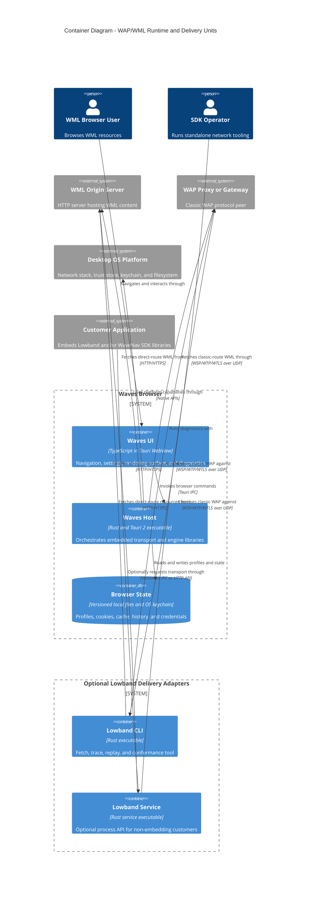

# C4 Container View: Runtime and Delivery Units

Date: 2026-07-24
Status: target architecture

This diagram shows independently running or deployed units. Lowband and WaveNav libraries are
shown in the component view because embedded libraries are not C4 containers.

## Container responsibilities

### Waves UI

- address and navigation controls;
- profile/settings management;
- render surface and input events;
- user-visible transport, content, and security state;
- diagnostic and trace export.

It does not parse WBXML or construct WAP packets.

### Waves Host

- owns Lowband and WaveNav instances in-process;
- applies authoritative host policy;
- schedules blocking transport work off the UI loop;
- maps Lowband deck payloads into WaveNav load calls;
- mediates local state and OS capabilities.

The browser remains one installable application even though its core libraries are separately
releasable products.

### Browser State

The state store is logically one container but uses fit-for-purpose platform storage:

- non-secret versioned data for history, bookmarks, gateway profiles, and cache metadata;
- OS keychain for proxy/origin credentials and sensitive tokens;
- bounded cache files for response bodies and decoded decks.

### Lowband CLI and Service

Both are thin delivery adapters over the Lowband public API:

- the CLI is the primary diagnostics and conformance surface;
- the service is optional for customers who need a process boundary or non-Rust integration;
- neither owns a separate codec or state-machine implementation.

The service is not part of the default desktop deployment.
