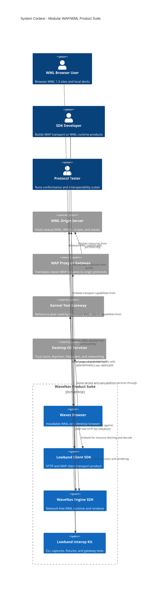

# C4 System Context: Modular WAP/WML Product Suite

Date: 2026-07-24
Status: target architecture

This view shows the separately consumable products and their external network relationships.
Lowband and WaveNav are software products that are embedded into a consuming application; they
are not remote services in the all-in-one browser.

## Context decisions

1. A normal installed browser embeds both SDKs and does not start a local transport server.
2. Direct HTTP/HTTPS and classic WAP are peer routes behind one Lowband client contract.
3. A classic WAP route targets a configured proxy/gateway; the resource origin remains a
   separate identity.
4. Kannel is a test and compatibility peer, not a product runtime requirement.
5. The interop kit is not a second protocol implementation. It wraps the same Lowband SDK.

## Scope boundary

The first complete product profile supports desktop IP networking:

- direct HTTP/HTTPS;
- WSP connectionless over WDP/UDP;
- WSP connection-mode over WTP/WDP/UDP;
- WTLS only when the secure compatibility profile is complete;
- WML 1.3 and WMLC/WBXML 1.3 content.

SMS, USSD, SMPP, and carrier-specific bearer adaptations remain separately gated adapters.
