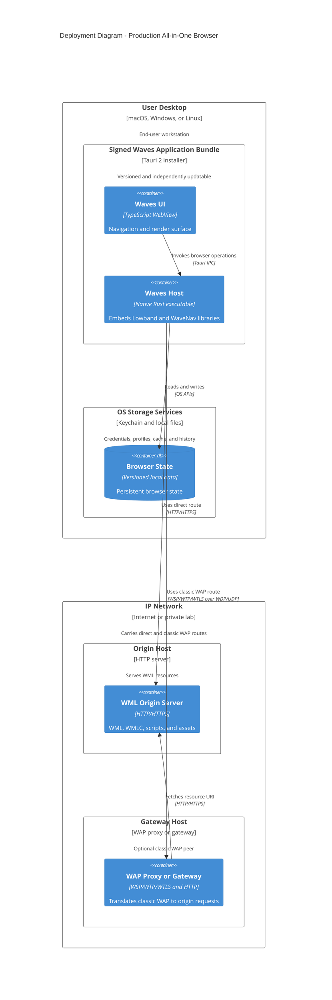

# C4 Deployment View: All-in-One Browser and Optional SDK Delivery

Date: 2026-07-24
Status: target production topology

The default deployment is one signed application bundle. A local Kannel process, Lowband daemon,
or separately installed WBXML decoder is not part of that topology.

## Deployment variants

### Default all-in-one browser

- one signed Tauri bundle;
- Lowband and WaveNav statically or natively linked into the host;
- a native WBXML codec, or a version-pinned sidecar included inside the same signed bundle;
- no localhost HTTP API and no local WAP gateway;
- optional connection to a remote WAP gateway profile.

### Rust SDK consumer

- customer application links `lowband-client`, `wavenav-engine`, or both;
- customer chooses its host UI and persistence adapters;
- SDK conformance behavior remains identical to Waves.

### Non-Rust SDK consumer

- preferred mobile path: generated language bindings around the stable facade;
- broad process-boundary path: optional Lowband service deployed by the customer;
- a service is never required solely because the full browser uses Tauri.

### Development and interoperability lab

- Kannel and the local WML server run in containers;
- the production Lowband SDK connects to Kannel as an external peer;
- packet capture, replay, and conformance artifacts are retained;
- lab containers are not shipped with the desktop installer.

## Production packaging gates

1. Tauri bundling is active for every supported target.
2. Every bundled executable/resource has a recorded version, source, checksum, and license.
3. Clean-machine tests prove no package-manager or PATH dependency.
4. The application starts and can browse textual WML even if an optional decoder backend fails.
5. Code signing/notarization, updater signatures, rollback, and SBOM checks are automated.
6. No WAP/OMA specification PDF is included in customer application artifacts.
