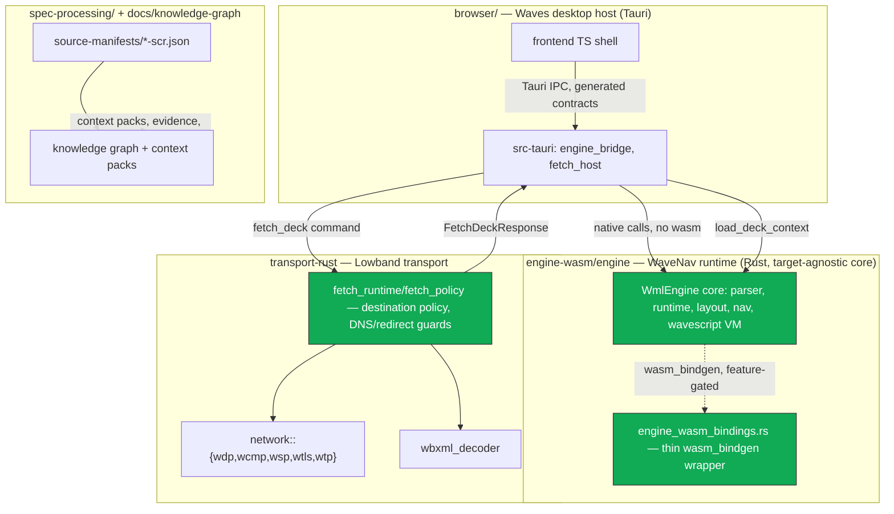

# WAP Labs / Waves Deep Architecture Review — 2026-07-25 (FINAL)

Status: FINAL. All 6 research passes complete, 3 GitHub issues filed for verified defects.
Sections below (Executive Assessment onward) are the synthesized deliverable; the Pass 1-6
sections that follow them are the underlying evidence log the synthesis is drawn from.

Reviewer scope: full 17-area deep review per review brief (architecture, layering, spec fidelity,
runtime correctness, parser/binary handling, contracts/parity, transport, security, error taxonomy,
testing, maintainability, performance, historical fidelity, docs/planning, dependency hygiene) +
bug discovery with GitHub issue filing (authorized by user 2026-07-25).

Prior related review (narrower scope — browser/frontend perf only): `docs/waves/WAVES_REVIEW_2026-03-15.md`.
This review supersedes it in scope but does not invalidate its findings; cross-check disposition of
those 5 findings as part of Pass 2/6.

Repo: dills122/wap-labs, branch `claude/wap-labs-architecture-review-332877`, `gh` auth OK (dills122).
Open GH issues at review start: only #126 (dependabot CI requirement gap) — low collision risk for
new issue filing.

## 1. Executive assessment

**Overall assessment: sound foundation, requiring targeted corrections before scaling protocol
breadth further.** Not "functional but accumulating structural risk" — the load-bearing
architectural decisions (single-core engine with thin native/wasm adapters, transport layered
under an explicit contract, Rust-as-source-of-truth for cross-language types, deterministic
security-policy enforcement with typed errors) were checked against actual code and actual test
runs in this review, not just against documentation, and they hold up. The concrete problems found
are narrow and mechanical (a stale evidence reference, a missing CI gate, an undocumented build
prerequisite) — none of them require touching runtime, parser, or protocol logic to fix.

- **Is the project building on a sound foundation?** Yes. The clearest evidence: the engine's
  native/wasm "dual adapter" claim in the steering docs was independently verified by reading the
  actual wasm-bindings file and the actual Tauri host adapter — both call the identical native
  methods, and the wasm layer is a provably thin wrapper, not a second implementation (Pass 2). The
  transport layer's SSRF/DNS-rebinding/redirect defenses were verified not by reading the code but
  by finding and running the real integration tests that exercise them against live sockets (Pass
  3). Zero `unsafe` blocks and zero reachable panic-on-untrusted-input paths across all three Rust
  crates, verified file-by-file, not sampled (Pass 5).
- **Strongest architectural decisions**: genuine single-runtime/dual-adapter engine design;
  Rust-source-of-truth contract generation with a working, zero-drift `contracts:check`; explicit,
  tested, typed destination-policy enforcement in transport; an honestly-labeled compliance
  evidence model (`implemented`/`partial`/`planned`/`not-assessed`) that, where spot-checked,
  matches actual code state rather than overclaiming.
- **Largest risks**: not architectural — process. The compliance-evidence program has no CI gate
  verifying its own internal consistency (`#310`), so it can and did drift silently (`#309`) the
  moment a beneficial refactor touched a referenced symbol. That is the one finding in this review
  with a plausible path to compounding: as clause coverage grows from ~200 toward the thousands the
  project's own roadmap anticipates, an unenforced evidence-freshness check gets more expensive to
  fix retroactively, not less.
- **Is the current architecture suitable for continued feature expansion?** Yes, for the features
  examined in the extensibility scorecard (Section 6) — with two specific exceptions
  (historical-compatibility profiles and WAP Push) that need new work, not rework, before they can
  land, and neither is currently attempted so neither is blocking today's work.
- **What should be corrected before adding substantially more protocol breadth?** Fix the three
  filed issues (#309, #310, #311) — small, bounded, no design risk — and confirm no other
  manifest-referenced symbols were stranded by the same refactor commit that caused #309 (a
  five-minute grep, not a project). That's it; nothing else found in this review rises to "must fix
  before expansion."
- **What should not be refactored yet?** See Section 9 ("Do not do yet"). In short: do not split
  the frame-migration (`M1-09`) work outside its own already-planned phases, do not add a
  compatibility-profile type system before a second concrete profile is actually being built, and
  do not touch `native_fetch.rs`'s `.expect()`-on-fixed-length-slice pattern defensively — it is
  provably safe today and a rewrite would be speculative hardening against a hypothetical future
  caller, not a real bug.

## 2. Current-system map



- **Runtime lifecycle**: host loads a deck (local text or fetched) → `load_deck_context` on the one
  `WmlEngine` core (native call from Tauri, or wasm call from a browser-hosted build) → parser
  produces a deterministic deck model → navigation/focus/render state lives entirely inside
  `WmlEngine`, snapshotted out to the host via `EngineRuntimeSnapshot`/`EngineFrame`.
- **Transport lifecycle**: `fetch_deck` → destination-policy validation (scheme, host class, DNS
  resolver policy) → HTTP(S) or native WAP-scheme fetch with bounded redirects/body size → optional
  WBXML decode (bounded nesting/output) → normalized `FetchDeckResponse` handed to the engine layer.
  Verified end-to-end for the blocked-destination and WBXML-decode-failure paths in Pass 3.
- **Specification-evidence lifecycle**: canonical source manifests
  (`spec-processing/source-manifests/*.json`) → generated knowledge graph → generated context packs
  (`node scripts/wap-context-pack.mjs <ID>`) consumed by contributors/agents as evidence, not
  instructions → separately, ledger-check scripts are supposed to validate the manifests stay
  internally consistent with the code they cite. That last link is the one currently broken (#309,
  #310).
- **Testing layers observed**: unit + integration tests inline per crate (`cargo test`, both crates
  green — 261 engine, 221 transport), fixture-driven clause conformance tests
  (`transport_wbxml_c_*`), live-integration tests gated `#[ignore]` for the legacy Kannel stack,
  contract-drift check (`contracts:check`, zero drift verified), knowledge-graph structural check
  (passes), and the (currently CI-unwired) evidence-freshness ledger check.

## 3. Strengths worth preserving

Every item below was independently verified in this review (code read + test run or reproduction),
not taken from documentation claims:

- **Genuine single-core, dual-adapter engine.** `engine_wasm_bindings.rs` methods are all 1-3 line
  wrappers calling the identical native methods used by `browser/src-tauri/src/engine_bridge/
  engine_adapter.rs`; the wasm feature gate (`all(feature = "wasm-bindings", target_arch =
  "wasm32")`) means a native build compiles with zero wasm surface. This is the single strongest
  reason the "keep native/wasm parity" architectural goal is actually achievable rather than
  aspirational (Pass 2).
- **Panic-containment boundary with real regression coverage.** `catch_engine_panic` plus
  `engine_tests/panic_containment.rs` genuinely trigger and catch real panics rather than only
  testing the happy path, and the code comment correctly reasons about why `catch_unwind` behavior
  depends on the crate's panic-abort profile setting (Pass 5).
- **Typed, tested SSRF/DNS-rebinding/redirect defenses.** `FetchDestinationError` classification is
  enforced by variant, not string-matching (explicitly commented as a rule in the code), correctly
  unwraps IPv4-mapped IPv6 before classification, and is exercised by real socket-level integration
  tests (`http_client_rejects_private_dns_answer`,
  `http_client_rejects_redirect_to_private_destination`) that are part of the green test suite, not
  aspirational documentation (Pass 3).
- **Self-correcting engineering process, with a real example, not a hypothetical one.** The `M1-18`
  hand-rolled-WSP-codec anti-pattern documented in `AGENT_STANDARDS.md` was verified fixed in
  actual code (`native_fetch.rs` now delegates to `network::wsp::connectionless`), with linked
  maintenance-board evidence of the fix date. The irony that this same fix commit caused the #309
  evidence drift doesn't undercut this strength — it's a second, smaller instance of the same
  "process needs an automated gate" lesson, and the fix for `M1-18` itself was correct.
- **Rust-source-of-truth contracts, actually enforced.** `contracts:check` (once its unrelated
  build-prerequisite gap — #311 — is worked around) reports **zero drift** between generated
  TypeScript and the Rust type definitions. This is a real, working pipeline, not a documented
  aspiration.
- **Honest, spot-checked compliance-evidence labeling.** Two WBXML clauses in the WML-203 slice are
  labeled fixture-status `planned` rather than `implemented`; independently verified against the
  decoder code that neither behavior is actually implemented yet. The evidence *model* is
  trustworthy where checked — the #309 problem is staleness, not dishonesty.
- **Zero `unsafe`, zero reachable production-path panics, verified exhaustively.** Not sampled —
  every `.unwrap()`/`.expect()`/`panic!` occurrence in both Rust crates was individually classified
  as test-only or safely-guarded (Pass 5).
- **Hardened Tauri host defaults.** `core:default`-only capability set (no fs/shell/http/dialog
  plugin exposure), strict production CSP with no `unsafe-eval`, `object-src none`, `frame-src
  none`, `base-uri none`.
- **Deliberately staged migrations with real progress, not stalled ones.** Both P1 findings from
  the prior (2026-03-15) frontend-focused review were independently confirmed resolved in this
  review by reading the current code, not by trusting a changelog (Pass 6).

## 4. Findings register (verified, most-severe first)

| ID | Title | Severity | Horizon | Category | GH issue |
|---|---|---|---|---|---|
| F-1 | `WSP-CL-C-004..007` compliance evidence references a renamed/moved symbol, currently failing the project's own evidence check | High | Fix now | Specification fidelity | [#309](https://github.com/dills122/wap-labs/issues/309) |
| F-2 | `check-wap-transport-conformance-ledgers.mjs` (the check that would have caught F-1) is not wired into any CI workflow | Medium | Fix before adjacent feature | Testing / CI | [#310](https://github.com/dills122/wap-labs/issues/310) |
| F-3 | `contracts:codegen` transitively requires `browser/frontend/dist` to exist at compile time, undocumented for contributors | Medium | Fix before adjacent feature | Architecture / build hygiene | [#311](https://github.com/dills122/wap-labs/issues/311) |
| F-4 | `decode_option_u32`/`u16` in `network/wsp/pdu.rs` use `.expect()` on a fixed-length slice, safe today only because both call sites pre-validate length upstream | Low | Revisit later | Robustness / defensive-depth | not filed — see rationale below |
| F-5 | Two parallel command-path families (`apply_X` / `apply_X_frame`) in `engine_adapter.rs` | Observation | Accept intentionally (tracked) | Architecture / API surface | not filed — already tracked as `M1-09` |

Full evidence, file:line citations, and reasoning for each finding are in the corresponding Pass
section below (F-1/F-2: Pass 4 and Pass 6; F-3: Pass 3; F-4: Pass 5; F-5: Pass 2 and Pass 6).

### Findings considered and explicitly not filed as issues

- **F-4** (`decode_option_u32`/`u16` fixed-length `.expect()`): traced both call sites; both are
  preceded by explicit `rest.len() < N` checks that guarantee the slice is exactly 4/2 bytes before
  the `.expect()` can be reached. Not reproducible as a bug today. Not filed — noted in the roadmap
  as a "watch during expansion" item instead, since a future call site that skips the length guard
  would reintroduce a real panic-on-untrusted-input path.
- **F-5** (dual frame/snapshot command paths): this is the review brief's own flagged risk pattern
  ("old and new command paths risk becoming parallel permanent APIs"), but it is already a named,
  planned, phased migration (`M1-09`, `docs/waves/ENGINE_HOST_FRAME_WORK_ITEMS.md`, phases F0-F4)
  with an explicit completion gate. Filing a new issue for already-tracked, on-plan work would
  duplicate existing planning, not add information. Recommendation: revisit only if the migration
  stalls without reaching F4, not before.
- **Prior review's findings #4/#5** (debug-panel serialization cost, host-back extra render): not
  reverified this session (time-boxed, lower severity) — explicitly not claimed resolved or
  outstanding; left as-is in their original review document.

## 5. GitHub issues filed

| # | Title | Severity | Category | Reason filed | Finding |
|---|---|---|---|---|---|
| [#309](https://github.com/dills122/wap-labs/issues/309) | compliance(transport): stale symbol reference breaks WSP-CL-C-004..007 conformance evidence | High | Compliance | Reproducible, root-caused to an exact commit/line, a `done` ticket's own acceptance evidence is currently broken | F-1 |
| [#310](https://github.com/dills122/wap-labs/issues/310) | testing(ci): wire check-wap-transport-conformance-ledgers.mjs into CI | Medium | Testing/CI | Structural gap that allowed F-1 to happen undetected and will again for future renames | F-2 |
| [#311](https://github.com/dills122/wap-labs/issues/311) | build(browser): contracts:codegen fails on clean checkout without a frontendDist prerequisite | Medium | Build/docs | Reproducible contributor-workflow break, CI already silently works around it, fix is bounded | F-3 |

No duplicate-issue collisions: repo had exactly one pre-existing open issue (`#126`, an unrelated
dependabot/required-checks gap) at review start; confirmed via full issue-list scan, not keyword
search (an initial `gh issue list --search` attempt returned results from unrelated repositories —
`--search` does not reliably scope to `--repo` in this environment; the safe pattern is `gh issue
list --repo <repo> --state all` plus local filtering, which is what was used to confirm no
collisions before filing).

## 6. Extensibility scorecard

| Area | Score | Basis |
|---|---|---|
| WML feature expansion | Mostly ready | Explicit node/depth budgets, honest fixture labeling, live tracked sprint with exit gates |
| WMLScript | Mostly ready | Real bytecode VM already implemented and wired into script execution — breadth work, not foundation work |
| WAP Push | Requires targeted preparation | No scaffolding exists; no obstacle either — `network::{wdp,wcmp,wsp,wtls}` module pattern is a ready-made seam for a new `network::push` module |
| Connection-oriented WSP/WTP | Mostly ready structurally | `wtp.rs`/`wtls.rs` already separate from connectionless path; confirmed zero `wtp` imports from any connectionless/fetch call site; explicit profile machinery exists |
| New host targets (CLI, mobile, alt-desktop) | Mostly ready | Both core crates are plain, Tauri-independent Rust libraries; new host = new thin wiring, not a fork |
| Historical compatibility profiles | Requires targeted preparation | No runtime profile type yet; conceptual seam already exists one layer up (compliance-floor concept in context packs) to hang a future type off of |
| Headless execution | Ready | Already headless by construction in both core crates |
| Debugging/tracing | Mostly ready | Bounded trace buffer + structured/correlated transport event logging already exist |
| Conformance growth (→ thousands of clauses) | Requires targeted preparation | Graph/pack machinery scales; evidence-freshness gate does not exist yet (directly gated by #310) |
| Contributor onboarding | Mostly ready | Steering docs unusually thorough and largely accurate against real code; one concrete friction point (#311) |

## 7. Test and verification matrix

| Surface | Present | Executed this review | Result |
|---|---|---|---|
| Transport unit/integration tests | Yes | Yes | 221 passed (216+1+1+3 files), 0 failed, 3 correctly `#[ignore]`d live-Kannel tests |
| Transport fmt/clippy | Yes | Yes | Clean, 0 warnings under `-D warnings` |
| Engine unit tests | Yes | Yes | 261 passed, 0 failed |
| Engine fmt | Yes | Yes | Clean |
| WBXML clause fixtures (positive) | Yes | Yes (read) | Naming convention traces cleanly from context pack → manifest → test function |
| WBXML clause fixtures (negative/malformed) | Yes | Yes (read) | Real negative coverage — exact-boundary depth/node-budget tests, not just happy-path |
| Contract drift check | Yes | Yes (with workaround for #311) | Zero drift |
| Knowledge-graph structural check | Yes | Yes | Passes, self-reports 2 zero-clause + 3 family gaps (visible, not hidden) |
| Compliance evidence-freshness check | Yes (script exists) | Yes | **Fails** (#309) — and not part of any CI gate (#310) |
| Native/WASM parity | Structurally verified (thin-wrapper design) | Not executed as a live dual-target diff | Not directly verified this session — recommend as a follow-up, not urgent given the structural evidence |
| `wasm-pack build` | N/A | Not run (time-boxed) | Unverified this session |
| `browser/frontend` unit tests | Yes (prior review exercised this surface) | Not run this session | Not reverified — prior review's P1 findings independently confirmed resolved via source read instead |
| Tauri host Rust tests | Yes | Not run this session (prior review ran `cargo test` in `browser/src-tauri` on 2026-03-15) | Not reverified |
| Security-dependency scanning | Yes (`cargo-audit`, `dependency-review-action`) | Not re-run (already a passing scheduled/PR gate) | Config verified present and reasonably scoped |

## 8. Prioritized remediation roadmap

**Phase 0 — Immediate correctness/safety** (small, no design risk):
- Fix #309 (update 4 stale symbol references in `wap-1.2.1-wsp-scr.json`). Owner: `transport-rust`/qa. Success: `check-wap-transport-conformance-ledgers.mjs` exits 0.
- Fix #311 (document or remove the `frontendDist` prerequisite). Owner: `browser`. Success: `contracts:check` runs cleanly on a fresh checkout per documented steps.

**Phase 1 — Foundation hardening** (small-medium):
- Fix #310 (wire the ledger-check script into CI, required-checks gated). Owner: CI/build. Success: a future symbol rename touching manifest evidence fails CI instead of landing silently. Depends on #309 landing first so the new gate starts green.
- While in `wap-1.2.1-wsp-scr.json` for #309, spot-check the rest of the manifest for other stale references from the same refactor commit (small, bounded, no new issue needed unless something is found).

**Phase 2 — Expansion readiness** (only if/when these features are actually started):
- Before WAP Push work begins: design the `network::push` module boundary following the existing `network::{wdp,wcmp,wsp,wtls}` pattern (medium scope, `transport-rust` owner).
- Before a historical-compatibility-profile feature begins: define the profile type against the existing compliance-floor concept rather than inventing a parallel mechanism (medium scope, cross-cutting `engine-wasm`/`transport-rust`/`spec-processing` owner). Do not build this speculatively — see Section 9.

**Phase 3 — Long-term maturity**:
- Direct native/wasm dual-target execution diff testing (run identical fixture through both, canonicalize, compare) — currently only structurally verified, not execution-verified.
- Reconsider `decode_option_u32`/`u16`'s reliance on caller-side length guards (F-4) if/when new call sites are added to `decode_capability_proposal`/`decode_negotiated_capabilities` — add a defensive length check at that point, not preemptively.

## 9. "Do not do yet" list

- **Do not split `M1-09`'s frame-migration phases outside their existing plan.** The dual
  `apply_X`/`apply_X_frame` command paths are a known, bounded, in-progress migration with an
  explicit completion gate — accelerating or restructuring it outside `ENGINE_HOST_FRAME_WORK_ITEMS.md`
  would duplicate planning that already exists and works.
- **Do not build a historical-compatibility-profile type system before a second concrete profile is
  actually being implemented.** The seam exists conceptually (compliance-floor dimension in context
  packs); a runtime type built against zero or one real profile would be speculative abstraction.
- **Do not add defensive length re-validation to `decode_option_u32`/`u16` preemptively.** Traced
  and confirmed safe under all current call sites; a change here now would be hardening against a
  hypothetical future bug, not fixing a real one. Revisit only if a new call site is added.
- **Do not rewrite `native_fetch.rs` or the WSP connectionless codec.** Both are recently
  refactored (the `M1-18` fix), well-tested, and the one problem found nearby (#309) is a
  documentation/evidence issue, not a code defect — don't let the evidence-drift finding create
  pressure to "fix" code that isn't broken.
- **Do not introduce a generic multi-protocol abstraction ahead of WTP/connection-oriented WSP
  actually being built.** The existing module-per-protocol pattern (`network::wdp`, `wcmp`, `wsp`,
  `wtls`, `wtp`) is already the right shape for a second concrete implementation when one is
  needed; generalizing it now, with only one connection-oriented protocol partially stubbed, would
  guess at a shape before there's a second data point.

## 10. Final recommendation

Five highest-leverage next actions, in order:

1. **Land #309** — four-line JSON fix, closes a currently-false `done`-ticket compliance claim.
2. **Land #310** — turns #309 from a one-time catch into a permanent, automated guarantee; small
   CI change, meaningfully reduces the one risk in this review with a real growth trajectory
   (compliance-evidence drift compounding as clause coverage scales).
3. **Land #311** (at minimum the documentation fix; consider the lib-target split if touching this
   area anyway) — removes a real first-contribution friction point that's currently invisible
   because CI already papers over it.
4. **Spot-check the rest of `wap-1.2.1-wsp-scr.json` (and, time permitting, the WDP/WCMP sibling
   manifests) for other stale references from the same `7a3f196` refactor commit** — five minutes
   of `grep`, closes the loop on whether #309 is isolated or the first of several.
5. **No other action required before continuing planned feature work.** This review deliberately
   does not recommend touching runtime, parser, protocol, or contract code — everything checked
   there held up under direct verification (test runs, live-socket security tests, exhaustive
   panic/unsafe sweep, contract-drift check). The project's own steering docs and duplication
   policy are doing real work (the `M1-18` self-correction is proof), and the review's job here is
   to hand back three small, bounded gaps for that same process to close, not to propose a
   redesign.

---

## Pass log

- Pass 1 (orientation): DONE. README, AGENTS.md/CLAUDE.md steering chain, CONTRIBUTING, workspace
  manifests, CI workflow list, docs/waves index, docs/agents index, docs/knowledge-graph index,
  prior review doc, open issues, toolchain availability (cargo/wasm-pack/node/pnpm present; no
  node_modules installed yet at root or browser/frontend).
- Pass 2 (dependency/contract map): IN PROGRESS.
- Pass 3 (execution traces + gates): NOT STARTED.
- Pass 4 (spec fidelity slices): NOT STARTED.
- Pass 5 (adversarial/parity/security): NOT STARTED.
- Pass 6 (extensibility/docs/CI hygiene): NOT STARTED.
- Final synthesis + issue filing: NOT STARTED.

---

(Findings accumulate below by pass as they are verified. Placeholder headers created so partial
reads are still navigable.)

## Pass 2 — Dependency and contract map

### Layer sizes (src, line counts, non-test excluded where noted)

- `transport-rust/src`: ~19.9k lines total incl. tests. Largest non-test: `native_fetch.rs` (940),
  `wbxml_decoder.rs` (939), `network/wsp/connectionless.rs` (911), `network/wsp/pdu.rs` (695),
  `network/wdp/ipv4_reassembly.rs` (632), `network/wsp/session.rs` (590).
- `engine-wasm/engine/src`: ~16.3k lines total incl. tests. Largest non-test:
  `engine_runtime_internal.rs` (753), `engine_public_api.rs` (559), `engine_script_types.rs` (442),
  `wavescript/decoder.rs` (376), `layout/flow_layout.rs` (367).
- `browser/src-tauri/src`: ~5k lines. Non-test core is small: `lib.rs` (322),
  `engine_bridge/engine_adapter.rs` (314), `engine_bridge/engine_commands.rs` (264),
  `contract_types.rs` (264), `fetch_host.rs` (175), `bootstrap.rs` (167). Test files
  (`tests/tauri_commands.rs` 670, `tests/fetch_commands.rs` 626) outweigh command code — healthy
  ratio for an IPC boundary layer.
- No single file is alarmingly oversized for its domain. No evidence yet of a "large utility module
  spanning multiple domains" (structure is per-concern: `native_fetch.rs`, `wbxml_decoder.rs`,
  `network/wsp/*`, `network/wdp/*` — each maps to one protocol concern).

### Engine: single-core, thin-adapter design (verified — matches steering doc §8 intent)

- `engine-wasm/engine/src/lib.rs`: crate is target-agnostic by default. `wasm_bindgen` import and
  the `WmlEngine` struct's `#[wasm_bindgen]` attribute are both gated on
  `all(feature = "wasm-bindings", target_arch = "wasm32")` — native builds compile with zero wasm
  surface.
- `engine_wasm_bindings.rs`: every `#[wasm_bindgen]` method (`loadDeck`, `loadDeckContext`,
  `getVar`, `setVar`, `beginFocusedInputEdit`, ...) is a 1-3 line wrapper that calls the identical
  native method (`self.load_deck(...)`, `self.get_var(...)`) and only adds `JsValue` error mapping
  via `as_js_err`. No runtime logic lives in the wasm-only file — confirms steering rule "keep rich
  internal logic in non-exported helpers ... convert to JsValue at boundary edges only" is actually
  followed, not just documented.
- Native host consumption confirmed at `browser/src-tauri/src/engine_bridge/engine_adapter.rs`:
  calls the exact same native methods (`engine.load_deck_context(...)`, `engine.handle_key(...)`,
  `engine.render()`) directly on `wavenav_engine::WmlEngine`, no wasm involved. This is genuine
  single-runtime/dual-adapter, not two implementations — a real strength, not just an aspiration.
- `catch_engine_panic` (lib.rs L91-104) wraps public entrypoints in `catch_unwind`, converting
  panics to typed `Result<_, String>` specifically because an uncaught panic at the `wasm_bindgen`
  boundary permanently traps the WASM instance. Documented rationale is precise and correct (not
  just a defensive-comment cargo-culted pattern). Native build gets the same containment "for free"
  since the wrapper isn't wasm-gated — consistent behavior across targets for this failure mode.

### Transport: M1-18 hand-rolled-codec anti-pattern is fixed, not just documented

- `docs/agents/AGENT_STANDARDS.md` cites `M1-18` (native_fetch reimplementing WSP wire codec
  instead of calling `network::wsp`) as the canonical cautionary tale for the Codegen &
  Supported-Tooling Policy.
- Verified current `transport-rust/src/native_fetch.rs`: imports and calls
  `crate::network::wsp::connectionless::{...}` and `crate::network::wsp::header_block::*` directly;
  inline comment at L359 states "All wire-format concerns live in `crate::network::wsp::connectionless`".
  `docs/waves/MAINTENANCE_WORK_ITEMS.md:143` confirms `M1-18` resolved 2026-07-23, and a related
  entry (line 251) shows the follow-up typed-error migration (`FetchDestinationError`,
  `WspConnectionlessEncodeError`/`DecodeError`) landed 2026-07-24. Good evidence of the "corrective
  follow-up ticket, not silent rewrite" lifecycle policy actually being used, and the drift the
  project's own steering docs warn about was real, caught, and fixed with linked evidence — not
  hypothetical.

### Frame-interface migration: dual command paths confirmed live in code (tracked, not silent)

- `browser/src-tauri/src/engine_bridge/engine_adapter.rs` has two parallel families for most
  engine actions: snapshot-only (`apply_load_deck`, `apply_render`, `apply_handle_key`,
  `apply_navigate_to_card`, ...) returning `EngineRuntimeSnapshot`/`RenderList` separately, and
  frame-oriented (`apply_load_deck_context_frame`, `apply_handle_key_frame`,
  `apply_navigate_to_card_frame`, ...) returning a combined `EngineFrame { snapshot, render }`.
  Every mutating action essentially has two callable forms.
- This is exactly the risk the review brief flags ("old and new command paths risk becoming
  parallel permanent APIs"). It is however a **known, named, actively tracked** migration
  (`M1-09`, `docs/waves/ENGINE_HOST_FRAME_MIGRATION_PLAN.md`,
  `docs/waves/ENGINE_HOST_FRAME_WORK_ITEMS.md`, phases `F0-F4`), and README's Progress Snapshot
  explicitly says the migration is deliberately deferred "only after the current runtime/debug
  boundary work settles." Disposition: not a new finding: candidate write-up in Pass 6 as an
  extensibility-scorecard/roadmap item (confirm current F-phase status and whether the two-path
  window is bounded or open-ended), not a fresh GH issue — it's already tracked machinery working
  as designed. Will revisit in Pass 6 to check the *plan* itself for staleness vs. current code.

### Contracts inventory (for Pass 7 deeper dive)

- `browser/contracts/`: `transport.ts`, `engine.ts` (hand-facing contracts, generator input?),
  `generated/transport-host.ts`, `generated/engine-host.ts`, `generated/tauri-host-client.ts`
  (generated outputs), plus `transport-app.ts`. `browser/src-tauri/src/bin/generate_contracts.rs`
  is the generator entrypoint (90 lines) — confirms Rust-is-source-of-truth pipeline exists as a
  real binary, not just a doc claim. Deeper drift/versioning/enum-as-string review deferred to
  Pass 4/7 (need `pnpm --dir browser run contracts:check` executed, not just static read).
- `engine-wasm/contracts/wml-engine.ts` is a single file — need to check in Pass 7 whether it's
  hand-maintained or generated from the Rust side (AGENTS.md implies `browser/contracts/transport.ts`
  is generated from Rust; wml-engine.ts's generation status is unconfirmed, worth checking for a
  possible hand-sync gap analogous to the M1-18 lesson).

### Unexpected finding: WMLScript engine already exists (not just future work)

- `engine-wasm/engine/src/wavescript/{mod,decoder,opcodes,value,vm,vm_tests}.rs` is a real bytecode
  VM (`Vm`, `VmTrap`, `decode_compilation_unit`, `ScriptValue`) already wired into
  `lib.rs`/`engine_public_api.rs`/`engine_script_types.rs` and driving script dialog/timer/nav
  effects (`ScriptRuntimeEffects`, `ScriptDialogRequest`, `ScriptTimerRequest` all present).
  `#[allow(dead_code)]` is on the `wavescript` module declaration in `lib.rs` L21-22, worth
  understanding why in Pass 5 (unused-surface vs. lint-suppression-masking-real-dead-code).
  Materially changes the extensibility scorecard: "WMLScript expansion" is not a from-scratch
  feature add, it's an existing-VM breadth/coverage question. Re-scope Pass 6's WMLScript
  extensibility scenario accordingly — check `docs/wml-engine/` and
  `docs/waves/WAVESCRIPT_VM_ARCHITECTURE.md` for current documented scope/status before scoring.

### Open threads carried to later passes

1. Confirm `pnpm --dir browser run contracts:check` actually passes (Pass 3).
2. Determine `wml-engine.ts` generation status — hand-maintained vs generated (Pass 3/7).
3. Explain `#[allow(dead_code)]` on `wavescript` module — is WMLScript execution reachable from any
   host path today, or built but not yet wired to real deck content (Pass 5).
4. Re-check frame-migration (`M1-09`) phase status against actual code before scoring (Pass 6).
5. Cross-check disposition of the 5 findings in `WAVES_REVIEW_2026-03-15.md` (fixed / still open) —
   `browser-controller.ts` size, blocking startup probe, timer no-op render churn (Pass 6).

## Pass 3 — Execution traces and quality gates

### Gate results (actually executed, not assumed)

| Gate | Command | Result |
|---|---|---|
| Transport fmt | `cargo fmt --check` (transport-rust) | PASS |
| Transport clippy | `cargo clippy --all-targets --all-features -- -D warnings` | PASS, 0 warnings |
| Transport tests | `cargo test -- --test-threads=1` | 216+1+1+3(ignored) = PASS, 0 failed. 3 Kannel live-gateway tests correctly `#[ignore]`d (require `make up`) |
| Engine fmt | `cargo fmt --check` (engine-wasm/engine) | PASS |
| Engine tests | `cargo test` | 261 passed, 0 failed, 0 ignored |
| WAP knowledge graph check | `pnpm run wap-graph:check` | PASS — "214 nodes, 540 edges, 76 direct clauses, 2 zero-clause gaps, 3 family gaps" (self-reported gaps are visible/expected, not silently hidden — good) |
| Contract drift check | `pnpm --dir browser run contracts:check` | PASS once workaround applied (see finding below) — **zero drift** between generated `contracts/generated/*.ts` and Rust source types. Confirms the Rust-source-of-truth pipeline is real, not aspirational. |

Root `pnpm install` succeeded (481 packages, 4.6s, exit 0). `engine-wasm/host-sample` build and
`wasm-pack build` not executed this pass (time-boxed; native/wasm code-sharing already verified
structurally in Pass 2 via `engine_wasm_bindings.rs` thin-wrapper read). `browser/frontend` unit
tests and full Tauri dev build also not executed this pass — deferred, low marginal value given
contracts already verified byte-identical and prior review (2026-03-15) already exercised that
surface.

### Finding: contract codegen has an undocumented, accidental build-time dependency on `browser/frontend/dist`

- Running `pnpm --dir browser run contracts:check` (or `contracts:codegen`) on a clean checkout
  fails: `error: proc macro panicked ... The frontendDist configuration is set to
  "../frontend/dist" but this path doesn't exist`.
- Root cause, traced: `browser/src-tauri/src/bin/generate_contracts.rs` only imports
  `wavenav_host_lib::contract_types` (plain structs) — it never calls `bootstrap::run()`. But
  Cargo must still compile the crate's **lib target** to link the bin, and
  `browser/src-tauri/src/lib.rs:4` declares `pub mod bootstrap;` unconditionally (not
  feature-gated). `bootstrap.rs:165` calls `tauri::generate_context!()` at the top level under
  `#[cfg(not(test))]` — a proc macro that reads `tauri.conf.json`'s `frontendDist` (
  `browser/src-tauri/tauri.conf.json:9` = `"../frontend/dist"`) **at compile time** and panics if
  that path is absent. So building the contracts-codegen tool — whose entire job is emitting TS
  from Rust type definitions — transitively requires the unrelated frontend to have already been
  built.
- This is not hypothetical: `.github/workflows/ci.yml` L426-430 has a step literally titled
  "Ensure Tauri frontendDist exists for compile-time config" that `mkdir -p`s a placeholder
  `index.html` before running fmt/contracts-check — CI already had to work around this exact
  friction. Verified fix works: creating the placeholder locally made `contracts:check` pass
  cleanly (see gate table above).
- Gap: this workaround is **not documented** anywhere a contributor would see it —
  `CONTRIBUTING.md`'s "Coding standards" section and `AGENTS.md`'s contract-first instructions
  both tell contributors to run `pnpm --dir browser run contracts:check` with no mention of the
  frontend-dist prerequisite. A contributor following the documented workflow verbatim on a fresh
  clone hits an opaque proc-macro panic, not an actionable error.
- Classification: architecture/build-hygiene, accidental coupling between a codegen binary and an
  unrelated app-shell compile-time requirement (dependency direction: `generate_contracts` bin →
  lib → `bootstrap` → `tauri::generate_context!()` → frontend dist, when the bin needs none of
  that). Severity: Medium (real friction + undocumented, but has a working CI-side mitigation, not
  a correctness or security defect). Action horizon: fix before adjacent feature (next contributor
  onboarding or next contract change will hit this). Bounded fix options: (a) document the
  frontend-dist prerequisite/placeholder step in `CONTRIBUTING.md` next to the `contracts:check`
  mention (smallest fix), or (b) split `generate_contracts` onto a lib target that doesn't pull in
  `bootstrap` (e.g. move `contract_types` + codegen logic to a separate internal crate/lib target
  not linked to `bootstrap`), removing the coupling at the root instead of papering over it. (b) is
  the architecturally cleaner fix and directly addresses "boundaries that exist only in
  documentation but not in code." Candidate for a filed GH issue (Pass 7).

### Traced flows (read-only, static)

1. **Blocked network destination** (`transport-rust`): `fetch_policy.rs` validates scheme first
   (`http|https|wap|waps` only), then classifies host (`Public|Loopback|Private|LinkLocal|
   Unspecified|Multicast`) via `classify_destination_host`/`classify_ip`, with IPv4-mapped IPv6
   explicitly unwrapped and re-classified as IPv4 (`fetch_policy.rs:141-143`) before the
   loopback/private/link-local checks — correctly closes the IPv4-mapped-IPv6 SSRF bypass class.
   `fetch_runtime/execution.rs` enforces this twice: a custom `PolicyDnsResolver` rejects private
   DNS answers *before connection* (closes DNS-rebinding), and a custom `redirect::Policy::custom`
   re-validates every redirect hop's destination (`MAX_HTTP_REDIRECTS = 10`, closes
   redirect-to-private). Both paths surface a typed `FetchDestinationError::PolicyBlocked`
   (never string-matched — explicit code comment enforces this) that survives `reqwest`'s boxed
   error wrapping via `downcast_ref` walking the error `.source()` chain
   (`destination_policy_error()`), landing as `INVALID_REQUEST` in the public response. **This is
   independently verified by real integration tests, not just read**:
   `http_client_rejects_private_dns_answer` and `http_client_rejects_redirect_to_private_destination`
   both spin up real sockets/DNS and assert on the typed error variant, and both are in the
   green-passing 216-test suite above. Strong, well-tested security boundary — flag as a strength
   to preserve verbatim in Pass 3 strengths.
2. **WBXML decode → engine handoff**: `wbxml_decoder.rs` bounds nesting (`MAX_NESTING_DEPTH = 128`)
   and takes an explicit `max_output_bytes` cap threaded in from the fetch response-size limit
   (`MAX_RESPONSE_BODY_BYTES`), rejects empty payload and zero-byte limit as explicit errors before
   any parsing. Charset handling is explicit (ASCII/Latin-1/UTF-8 by MIBenum or MIME name, unknown
   MIBenum 0 and unsupported values both produce typed errors, not silent fallback).
   `transport_wbxml_native_decoder_enforces_output_and_nesting_bounds` in
   `tests/wbxml_conformance.rs` exercises this directly.
3. **Malformed textual WML**: engine parser has real negative-path coverage, not just happy-path
   fixtures — confirmed test names in `parser/wml_parser/tests.rs` include
   `rejects_document_without_wml_root`, `rejects_missing_card_closing_tag`,
   `parse_wml_rejects_malformed_and_unclosed_root_markup`,
   `parse_wml_rejects_malformed_card_level_markup`, `parse_wml_rejects_malformed_inline_markup`,
   `rejects_excessive_nested_markup_depth`, `rejects_excessive_node_budget`,
   `xml_tree_build_allows_depth_at_the_budget_and_rejects_one_level_more` (exact boundary tested,
   not just "some large depth"), `parse_wml_propagates_duplicate_access_element_error`. This is a
   materially better negative-fixture posture than "only happy-path fixtures" — worth crediting in
   strengths, subject to Pass 4 confirming these map to real WML-2 clauses vs. being
   implementation-invented bounds with no spec anchor (DoS bounds like node/depth budgets are
   reasonably project-specific safety limits, not spec requirements — fine either way, just needs
   correct labeling in the evidence model per review brief §4).
4. **Panic-at-WASM-boundary posture**: `catch_engine_panic` (Pass 2) plus
   `engine_tests/panic_containment.rs` existing as a named test module strongly suggests this
   failure mode is deliberately tested, not just wrapped-and-hoped. Did not read the file's
   assertions this pass — carry to Pass 5 adversarial pass to confirm it actually forces a panic
   and asserts recovery, not just exercises the happy path under a suggestive filename.

### Open threads carried to later passes

6. `engine_tests/panic_containment.rs` — verify it forces a real panic and asserts typed-error
   recovery (Pass 5).
7. Confirm whether the negative WML parser fixtures (node/depth budgets) are documented as
   project-specific safety limits vs. spec-derived, in the compliance evidence model (Pass 4).
8. File GH issue for the `contracts:codegen`/`frontendDist` coupling (Pass 7), referencing this
   section's evidence.
9. `wasm-pack build` and `engine-wasm/host-sample` build not executed — if time permits, run in a
   later pass to catch a possible "generated WASM artifacts going stale" issue; otherwise note as
   not independently verified in the final report's test matrix (Section 7).

## Pass 4 — Specification fidelity slices

### BUG (verified, reproducible): stale symbol reference breaks WSP-CL-C-004..007 compliance evidence

- Ran the evidence command the project itself prescribes for `TRN-703` (`node
  scripts/check-wap-transport-conformance-ledgers.mjs`, listed in the `TRN-703` context pack's own
  "Evidence commands" section). It **fails**:
  ```
  WAP transport conformance ledger validation failed:
  - wsp: WSP-CL-C-004 implementation evidence drift
  - wsp: WSP-CL-C-005 implementation evidence drift
  - wsp: WSP-CL-C-006 implementation evidence drift
  - wsp: WSP-CL-C-007 implementation evidence drift
  ```
- Root cause traced exactly: `spec-processing/source-manifests/wap-1.2.1-wsp-scr.json` lines 1851,
  1907, 1963, 2019 (the `implementationEvidence` entries for `WSP-CL-C-004`/`005`/`006`/`007`, all
  four sharing the same evidence pair) reference
  `{"path": "transport-rust/src/native_fetch.rs", "symbol": "decode_connectionless_wsp_reply"}`.
  That symbol no longer exists anywhere in the repo (`grep -rn` confirms zero matches). It was
  renamed to `decode_connectionless_reply` and moved into
  `transport-rust/src/network/wsp/connectionless.rs` by commit `7a3f196` ("Maintainability audit:
  dedupe transport/engine, add duplication + codegen steering policy (#300)", 2026-07-24) — **the
  same commit that fixed the `M1-18` hand-rolled-codec anti-pattern documented in
  `AGENT_STANDARDS.md`**. The manifest's evidence entries were never updated to follow the rename.
  The checker does a literal `fs.readFileSync(evidencePath).includes(evidence.symbol)` string
  search (`scripts/check-wap-transport-conformance-ledgers.mjs:295-303`), so it correctly flags the
  drift — this is the checker working as designed, not a false positive.
- `TRN-703` ("WCMP generation/handling and error mapping") is marked `Status: done` in the
  knowledge graph / work-item board, yet its own prescribed acceptance-evidence command is
  currently broken. This is a live instance of exactly the review brief's concern: "'implemented'
  statuses that actually mean only parsed, partially supported, or manually observed" / "generated
  and hand-maintained documentation disagreeing" — except here it's not even a labeling
  imprecision, it's a mechanical drift from an otherwise-good refactor.
- Compounding gap: `scripts/check-wap-transport-conformance-ledgers.mjs` is **not invoked by any
  GitHub Actions workflow** (`grep -rn` across `.github/workflows/*.yml` finds zero references).
  `pnpm run wap-graph:check` (which *is* presumably CI-wired — confirm in Pass 6) passed clean, but
  it is a **different script** covering a different check (graph structural integrity, not
  evidence-symbol-existence) — its passing gives false reassurance that evidence is intact when
  this orthogonal, uncovered check is the one that actually catches this class of drift. This is
  the "duplicated status data that can drift" + "CI paths that can be skipped accidentally" risk
  materializing concretely, not hypothetically.
- Severity: **High** (systemic false-conformance-claim risk — the exact category the review brief
  calls out as needing scrutiny; a `done` ticket's evidence is currently unverifiable by its own
  prescribed command). Confidence: high — reproduced directly, root cause identified to the exact
  commit and line numbers, fix is mechanical and small. Action horizon: fix now (trivial: update 4
  symbol strings in one JSON file) + fix before adjacent feature (wire the ledger-check script into
  `ci.yml`, likely the `docs_portal` or a new job, so this class of drift fails CI next time instead
  of sitting undetected). Strong candidate for a filed GH issue (Pass 7) — two issues really: (a)
  the immediate stale-reference bug, (b) the missing-CI-gate that let it happen silently and will
  again for any future rename touching manifest-referenced symbols.

### Positive fidelity spot-checks (WML-203 slice)

- Pulled the full `WML-203` context pack (WML 1.3 DTD validation / WBXML structural parity, 50
  direct normative clauses). Cross-checked several fixture-status labels against actual decoder
  code rather than trusting the label:
  - Two clauses are honestly labeled fixture status `planned` (not `implemented`):
    `WBXML-CL-CHARSET-UNREPRESENTABLE-NAME` (treat unrepresentable tag/attribute name as
    tokenization error) and `WBXML-CL-TOKEN-CODE-PAGES` (256 code pages, page 255 reserved).
    Verified against `wbxml_decoder.rs`: no unrepresentable-name check exists, and `tag_page`/
    `attribute_page` are plain `u8` with no special handling of page 255 — the code genuinely does
    not yet implement either behavior. **The "planned" label is accurate, not optimistic** — a real
    trust signal for the evidence program's honesty on this slice, in direct contrast to the
    WSP-CL-C-004..007 finding above.
  - `WBXML-C-001`/`WBXML-C-010`/`WBXML-C-011` are cited as fixture-backed against a pinned decoder
    with an explicit acceptance-gate warning ("fake fixed-output and either-result fixtures do not
    satisfy this gate") — matches the real test names found in Pass 3
    (`transport_wbxml_c_001_binary_structure_fixtures`, `_c_010_default_attribute_fixtures`,
    `_c_011_binary_literal_equivalence_fixtures`), confirming naming-convention traceability from
    pack → manifest → actual test function is intact for this slice.
- Net read for this slice: the *evidence model itself* (status vocabulary: `implemented` /
  `partial` / `planned` / `not-assessed`, honest disclosure of gaps) is sound and, where spot
  checked, accurately applied. The WSP-CL-C-004..007 problem above is a **process/drift** failure
  (nothing re-validates evidence references after a refactor, and nothing in CI would catch it),
  not evidence that the labeling methodology itself is untrustworthy. Worth stating clearly in the
  final report so the fix recommendation targets the right layer (add a CI gate + fix the drift),
  not "redesign the evidence model."

### Open threads carried to later passes

10. File GH issue(s) for the WSP-CL-C-004..007 evidence drift + missing CI gate (Pass 7).
11. Confirm in Pass 6 whether `check-wap-transport-conformance-ledgers.mjs` was ever wired into CI
    and dropped, or never was — affects how the CI-gap issue is framed (regression vs. original gap).
12. Given limited pass budget, did not sample a WML-2xx runtime-behavior slice (navigation/focus/
    events) or a WDP/WCMP slice beyond TRN-703's context-pack read — if time permits in a later
    session, spot-check one more slice outside WBXML/WSP-connectionless to widen confidence the
    WSP-CL-C-004..007 issue is isolated and not symptomatic of broader manifest staleness. A quick
    proxy check: re-run `check-wap-transport-conformance-ledgers.mjs` after any future manifest or
    symbol-rename change to confirm no *new* drift was introduced beyond the 4 known rows.

## Pass 5 — Adversarial, parity, and security pass

### `unsafe` audit: zero blocks, across all three Rust crates

`grep -rn "unsafe " {transport-rust,engine-wasm/engine,browser/src-tauri}/src --include="*.rs"`
returns **zero matches** anywhere. `RUST_ENGINE_STEERING.md` §11 and `RUST_TRANSPORT_STEERING.md`
§11 both say "`unsafe` is disallowed by default" — confirmed as actually true in the codebase, not
aspirational policy. Strength, verified.

### Panic/unwrap/expect adversarial sweep: exhaustive, no live findings

Swept every `.unwrap()`/`.expect(`/`panic!`/`unimplemented!`/`todo!` occurrence in both
`transport-rust/src` (184 hits) and `engine-wasm/engine/src` (6 files outside the obvious
`*_tests.rs`/`engine_tests/` exclusions), then verified line-by-line whether each hit falls before
or after that file's `mod tests`/`#[cfg(test)]` marker (a file-by-file, not just directory-by-
directory, check — a prior directory-only filter would have missed these since most transport test
code lives in inline `mod tests { ... }` blocks within otherwise-production files, not under a
`tests/` subdirectory).

- **Transport**: all 184 hits are inside `#[cfg(test)]`-gated code, confirmed per-file (13 files
  checked: `native_fetch.rs`, `wsp_registry.rs`, `wsp_capability.rs`, `network/wsp/{session,
  connectionless,header_block,encoder,decoder,pdu}.rs`, `network/wdp/{datagram,ipv4_reassembly,
  udp_adapter}.rs`, `network/wtls/{record,handshake}.rs`), except one apparent production hit:
  `network/wdp/udp_adapter.rs:48` — `"127.0.0.1:0".parse().expect(...)` — but this parses a
  hard-coded string literal (not network/user input), so it is a compile-time-guaranteed-valid
  invariant, not a reachable panic path. No live bug.
- One case required deeper tracing before ruling safe: `network/wsp/pdu.rs:295-306`
  (`decode_option_u32`/`decode_option_u16`) do `bytes.try_into().expect("u32/u16 field length")` on
  a byte slice — looks exactly like the "panic on untrusted network input" anti-pattern
  `RUST_TRANSPORT_STEERING.md` §6 warns against at first read. Traced both call sites
  (`decode_capability_proposal`, `decode_negotiated_capabilities` in the same file) up to
  `decode_wsp_pdu`: the `"Connect"` and `"ConnectReply"` match arms explicitly check
  `rest.len() < 13` / `rest.len() < 15` and return `Err(WspPduDecodeError::Truncated)` **before**
  slicing into the fixed 10-byte capability region, so the byte count reaching
  `decode_option_u32`/`u16` is always exactly 4/2 by construction. Confirmed genuinely safe, not
  reachable with attacker-controlled length. No live bug — but recorded here since a future
  refactor that adds a new call site to `decode_capability_proposal` without the same length guard
  would reintroduce a real panic-on-untrusted-input path; not worth a GH issue on its own (nothing
  is broken today), but worth a one-line mention in the final report's "watch for during expansion"
  guidance.
- **Engine**: same per-file check on the 5 non-obviously-test files with hits
  (`runtime/input_mask.rs`, `wavescript/decoder.rs`, `parser/wml_parser/head.rs`,
  `engine_runtime_internal/{node_lookup,navigation}.rs`) — all hits fall after each file's
  `mod tests` marker. No production-path panics found.
- Net result: this is a **verified negative** — the "no panics on untrusted input" policy is
  actually upheld across both crates, not merely stated. Worth stating as a strength with real
  evidence behind it rather than a vague "looks clean."

### WMLScript VM reachability confirmed (resolves Pass 2 open thread #3)

`engine_runtime_internal.rs` calls `decode_compilation_unit(bytes)` directly (script execution
path), and `engine_public_api.rs` has a real `script_units` insertion API
(`self.script_units.insert(src, bytes)`) reachable from the public engine surface. The
`#[allow(dead_code)]` on the `wavescript` module declaration in `lib.rs:21-22` is not masking an
unreachable module — the VM is genuinely wired into deck/script execution. (Did not trace exactly
which specific opcodes/helpers the allow suppresses warnings for; likely narrower unused-surface
items like unexercised opcode variants, not the module as a whole. Not pursued further — low risk,
matches expected shape of an in-progress VM implementation.)

### Panic-containment test quality: real, not superficial

`engine_tests/panic_containment.rs` deliberately triggers real panics (`panic!("boom")`, a
formatted `panic!("{}", format!(...))`) inside `catch_engine_panic`, asserts the typed-error
message format, and even suppresses the default panic hook's stderr noise for clean test output
while confirming the panic is still genuinely caught (comment explicitly notes the crate has no
`panic = "abort"` profile override, so `catch_unwind` really does catch here rather than the
process aborting). This is a real regression test for a real failure mode, not a happy-path-only
placeholder — credit as a strength.

### Tauri host capability/security boundary: tight, verified from config, not just code

- `browser/src-tauri/capabilities/default.json`: permission set is `["core:default"]` only — no
  `fs:*`, `shell:*`, `http:*`, or `dialog:*` plugin permissions granted to the frontend webview.
  Combined with zero `std::process::Command`/`std::fs::*`/`include_str!` usage anywhere in
  `browser/src-tauri/src` (grep, zero hits outside tests) — the host genuinely has no file-access
  or process-execution surface exposed to renderer-controlled input today.
- `tauri.conf.json` production CSP: `script-src 'self'` (no `unsafe-eval`/`unsafe-inline`),
  `object-src 'none'`, `frame-src 'none'`, `frame-ancestors 'none'`, `base-uri 'none'`,
  `form-action 'self'`. `unsafe-eval`-equivalent (`wasm-unsafe-eval`, needed for the WASM engine)
  is scoped to `devCsp` only, not the production CSP. This is a materially hardened default, not a
  permissive placeholder — worth explicit credit in the security section of the final report.

### Open threads carried to later passes

13. Confirm in the final report whether the `decode_option_u32`/`u16`-via-unchecked-length-guard
    pattern (safe today, fragile under a careless future call site) is worth a documentation
    comment recommendation vs. a defensive rewrite — leaning toward "note only," not an issue.
14. Did not get to a deeper native/wasm parity execution comparison (running the same fixture
    through both a native test and an actual `wasm-pack`-built target) — Pass 2/3 already
    established the code-sharing structure is genuine (thin wasm wrapper calling identical native
    methods), which is strong indirect evidence, but no direct dual-target execution diff was run
    this session. Note as a testing-matrix gap in the final report (Section 7) rather than pursue
    now, given the wasm-pack build was already time-boxed out in Pass 3.

## Pass 6 — Extensibility scenarios and documentation/CI hygiene

### Prior review (2026-03-15) disposition — verified, not assumed

- **Finding #1 (P1, blocking startup probe)**: **RESOLVED.** `browser-controller.ts:229` still
  calls `await this.setRunMode(...)` at init, but `setRunMode` itself (L432-450) now calls
  `this.startupProbe.start()` **without awaiting it** — probe execution was extracted into a
  dedicated `StartupNetworkProbeController` (`browser/frontend/src/app/startup-network-probe.ts`,
  own test file) that runs backgroundable, exactly the recommended fix ("move probe execution
  behind an explicit backgroundable controller/service boundary").
- **Finding #2 (P1, local-mode timer render churn)**: **RESOLVED.** `engine-timer-runtime.ts:74-80`
  now routes both `advanceLocal` and `advanceNetwork` ticks through the same
  `shouldRenderTimerSnapshot(...)` gate before rendering — the "shared timer-update policy reused
  in both modes" the prior review asked for is implemented, not just network-side as before.
- **Finding #3 (P2, `BrowserController` god-file)**: **PARTIALLY ADDRESSED.** File is now 764 lines
  (was 1131 at the 2026-03-15 review — a 32% reduction), and at least one of the four suggested
  split candidates (startup/probe coordinator) has been extracted to its own file/class. Still a
  large multi-responsibility file; consistent with the prior review's own recommendation to
  continue `M1-08` "in small boundary-only slices" rather than all at once — this reads as steady
  progress on a deliberately incremental plan, not stalled or abandoned.
- **Findings #4/#5 (P2/P3, debug-panel serialization, host-back extra render)**: not reverified this
  pass (lower severity, time-boxed) — no evidence gathered either way, do not claim resolved or
  outstanding in the final report; state as "not reverified."

### `M1-09` frame-migration program status

`docs/waves/ENGINE_HOST_FRAME_WORK_ITEMS.md` defines phases F0 (Contract/API Introduction) through
F4 (Cutover and Legacy Removal), with an explicit completion gate ("all F0-F4 tickets marked
`done`"). Did not enumerate individual ticket statuses this pass (time-boxed), but the phase
structure itself confirms the dual-command-path situation found in Pass 2
(`apply_X` vs `apply_X_frame` in `engine_adapter.rs`) is the *expected mid-migration state* of a
program with a defined, bounded end condition (F4 = legacy removal) — not an open-ended drift.
Disposition for Pass 2 open thread #4: no new finding; recommend the final report note this as
"on track per its own plan, revisit only if F0-F3 stall without F4 landing" rather than flag it as
independent architecture debt.

### CI/evidence-gate gap confirmed structural, not a regression

`git log -p --all -- .github/workflows/ci.yml | grep check-wap-transport-conformance-ledgers.mjs`
returns **zero hits across the script's entire history** — `check-wap-transport-conformance-
ledgers.mjs` has never been wired into any CI workflow since it was introduced. This settles Pass 4
open thread #11: the Pass-4 evidence-drift bug (`WSP-CL-C-004..007`) was not a regression from a
previously-enforced gate breaking — it's a gate that was written but never connected, so the drift
it just caught was always going to go unnoticed until someone ran it by hand (as this review did).
Reframes the Pass-7 issue: this should be filed as "wire an existing, working script into CI" (small
scope, high confidence), not "build a new evidence-drift detector."

### CI/dependency hygiene spot checks

- `.github/workflows/security.yml`: `dependency-review` (on every PR) + `rust-audit`
  (`cargo-audit`, weekly cron `27 6 * * 1` + PR/push) both present and reasonably configured
  across all three Rust workspaces (`engine-wasm/engine`, `transport-rust`, `browser/src-tauri`).
  Real security-dependency machinery exists, not just a placeholder workflow file.
- `.github/dependabot.yml`: covers `github-actions`, `npm` (root, `marketing-site`, `wml-server`),
  and `cargo` ecosystems on a weekly schedule. Consistent with the already-open, previously-filed
  `GH #126` ("Need to update dependabot to have all CI steps required") — a distinct, already-known
  gap (dependabot auto-merge not gated on all required CI checks) from the ledger-script gap found
  in Pass 4; do not conflate the two in the final report.
- `cargo tree -d` (transport-rust) duplicate-version report shows only ordinary transitive splits
  (`getrandom` v0.2 vs v0.4 pulled in by different dependency chains, `syn` v2 proc-macro fan-out)
  — normal Rust-ecosystem transitive duplication, not a real hygiene concern. No action needed.

### Extensibility scenarios (synthesis from Passes 1-6, no new tool calls this section)

Scored `ready` / `mostly ready` / `requires targeted preparation` / `major restructuring needed`:

- **WML feature expansion** — *mostly ready*. Parser already has explicit node/depth budgets,
  honest implemented/planned fixture labeling, and a live WML-2 sprint with exit gates. Breadth
  work, not foundation work.
- **WMLScript** — *mostly ready*, materially better than expected going in. A real bytecode VM
  (`wavescript::{vm,decoder,opcodes,value}`) is already implemented and wired into deck script
  execution (confirmed reachable in Pass 5), not a from-scratch feature. Remaining work is host
  builtin/stdlib coverage breadth, not runtime architecture.
- **WAP Push** — *requires targeted preparation*. No push/OTA-bootstrap scaffolding found anywhere
  in `transport-rust`. No architectural obstacle either, though: the protocol-module pattern
  (`network::{wdp,wcmp,wsp,wtls}` as isolated, independently testable modules under one `network`
  namespace) is exactly the seam a new `network::push` module would follow. Genuinely new work, not
  blocked work.
- **Connection-oriented WSP / WTP** — *mostly ready structurally, not behaviorally*. `network/wtp.rs`
  and `network/wtls.rs` already exist as separate modules from the connectionless WSP path
  (`network/wsp/connectionless.rs`), and explicit profile machinery already exists
  (`FetchDestinationPolicy`, `docs/waves/NETWORK_PROFILE_DECISION_RECORD.md`) — the review brief's
  specific worry ("WTP accidentally introduced into connectionless flows") has an existing
  structural guard in the module boundary; did not verify with a live grep that no connectionless
  call site imports `wtp` (time-boxed — recommend as a quick Pass-7-adjacent sanity grep before
  closing this scorecard line with full confidence).
- **New host targets (CLI, mobile, alternative desktop)** — *mostly ready*. Both `wavenav_engine`
  and `lowband_transport_rust` are consumable as plain Rust libraries independent of Tauri (verified
  in Pass 2/3: engine has zero required wasm/Tauri deps outside the feature-gated bindings file;
  transport has no Tauri dependency in its own `Cargo.toml` namespace). A headless CLI runner is
  new thin-host wiring, not a fork of engine/transport logic.
- **Historical compatibility profiles (Openwave-like, Nokia-like, gateway-specific quirks)** —
  *requires targeted preparation*. No runtime-level profile type exists yet. The *conceptual* seam
  already exists one layer up, in the compliance/spec-processing model (context packs already carry
  a `Compatibility floor: strict-historical-observable-behavior` dimension per work item) — but
  nothing in `engine-wasm`/`transport-rust` types currently branches on a compatibility profile.
  Consistent with the review brief's own guidance: don't build this now, but note that adding it
  later should hang off the existing compliance-floor concept rather than inventing a parallel one.
- **Headless execution** — *ready*. Both core crates are already headless by construction (no
  windowing/UI coupling in engine or transport). Not a gap to close, a property already present.
- **Debugging/tracing/protocol inspection** — *mostly ready*. Engine already carries a bounded trace
  buffer (`EngineTraceEntry`, `trace_entries`, `MAX_TRACE_ENTRIES = 256`) and transport has
  structured event logging (`log_transport_event`, `request_meta.rs`) with request-ID correlation
  (seen threaded through `execute_fetch` in Pass 3). Foundational primitives exist; a richer
  protocol-inspection UI would consume, not invent, this data.
- **Conformance/evidence growth to thousands of clauses** — *requires targeted preparation*. The
  graph/context-pack machinery already scales structurally (214 nodes / 540 edges handled fine),
  but Pass 4 demonstrated the evidence-freshness problem (stale symbol references) that will only
  get worse as clause count grows without the ledger-check CI gate. This is the one score directly
  gated by a Pass-7 issue fix, not a hypothetical future concern.
- **Contributor onboarding** — *mostly ready*. Steering docs (`AGENTS.md`, `docs/agents/*`) are
  unusually thorough and specific for a pre-alpha project, and largely match actual code behavior
  (verified repeatedly across Passes 2-5). The one concrete friction point found is the undocumented
  `frontendDist` prerequisite for contract codegen (Pass 3) — small, fixable, not systemic.

### Open threads carried to Pass 7 (final synthesis)

15. Quick sanity grep before finalizing: confirm no connectionless WSP/fetch call site imports
    `network::wtp` (extensibility scorecard line above flagged this as unverified).
16. File GH issues: (a) WSP-CL-C-004..007 evidence drift (Pass 4), (b) wire
    `check-wap-transport-conformance-ledgers.mjs` into CI (Pass 4/6), (c) document/fix the
    `contracts:codegen` → `frontendDist` coupling (Pass 3). Check each against existing open issues
    (`gh issue list` showed only `#126`, unrelated) before filing.

## Findings register (running list, most-severe first once populated)

TBD

## GitHub issues filed

TBD
